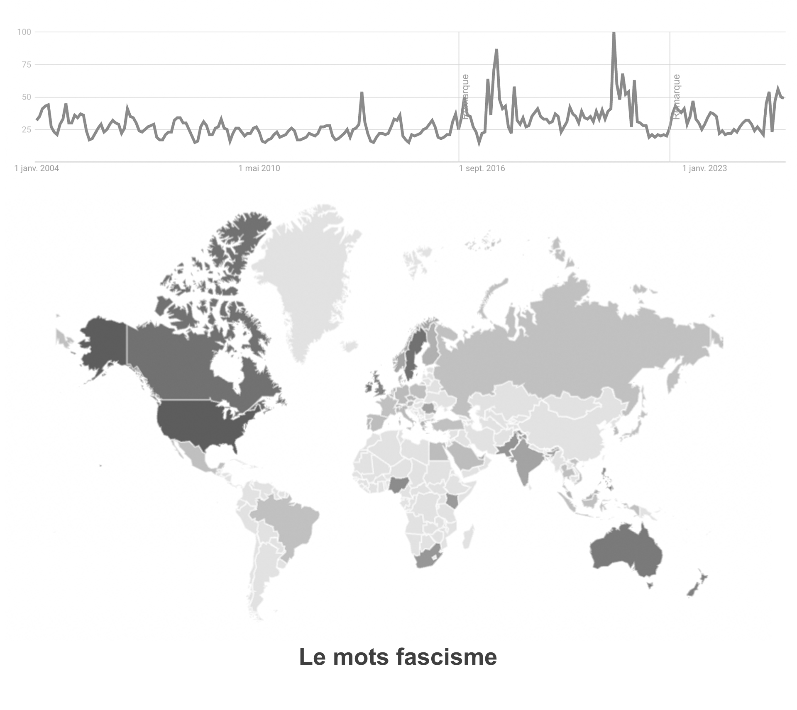
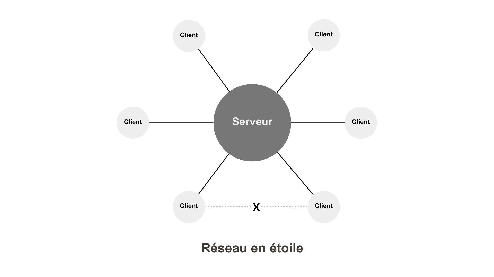
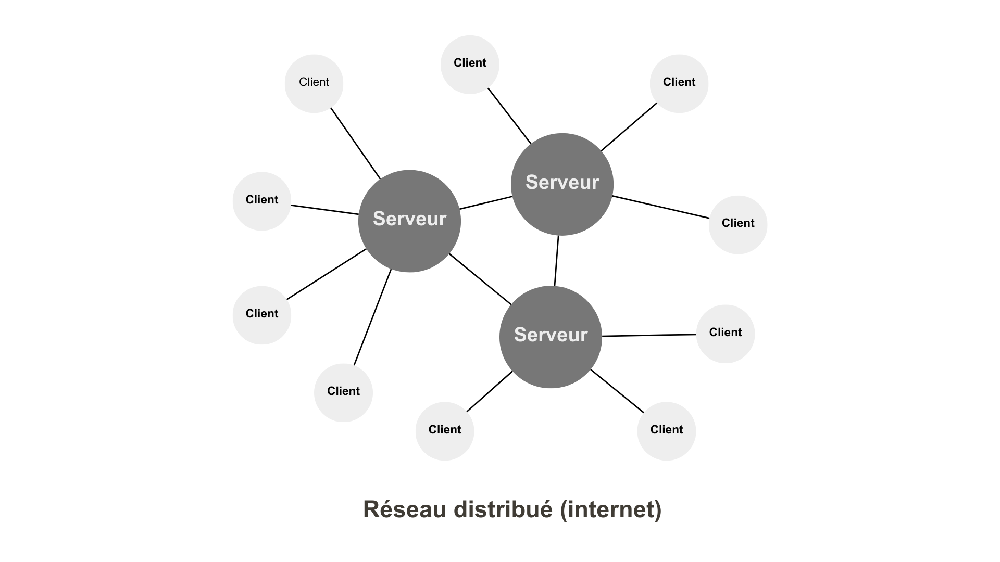
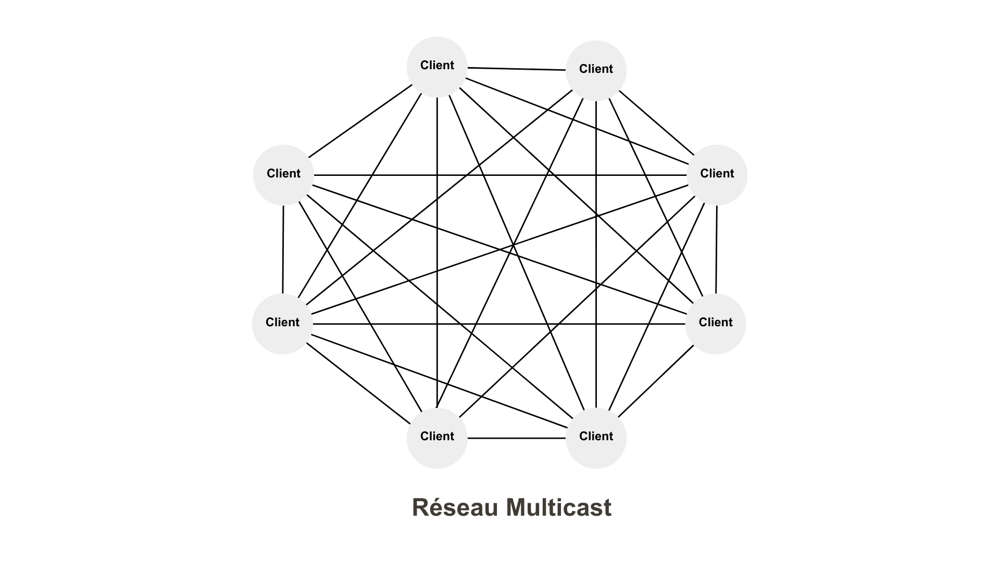
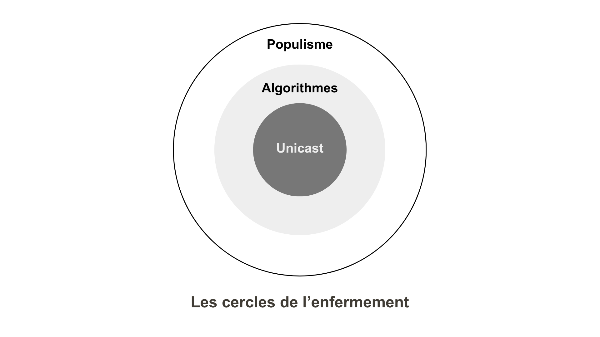
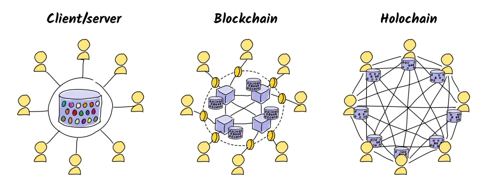

L’inquiétude ne cesse de croître face aux poussées autoritaristes qui animent les dirigeants politiques en Russie, en Chine, aux États-Unis, au cœur même de l’Europe, pourtant construite pour éviter la répétition des horreurs passées. Dans ce contexte anxiogène, pour fêter l’investiture de Donald Trump, élu quarante-septième président des États-Unis, Elon Musk, son comparse du moment, lève le bras droit, le tend, main à l’horizontale : un salut nazi[^1] ! Des observateurs ont qualifié ce moment, le 20 janvier 2025 à Washington, de jour zéro du technofascisme[^2]. En vérité, cette « chose » encore mal définie se répand depuis des décennies. Pour nous en défendre, à titre individuel, collectif et institutionnel, il ne nous reste que les livres et les autres objets culturels qui circulent comme eux, à travers un réseau de distribution maillé à la surface des territoires, hors de la juridiction des centres de pouvoir oligarchique. Après l’inquiétude monte l’espoir d’un réveil. Le Livre avec un grand L contre-attaque, et ce petit texte part à l’assaut des murailles adverses.

# Quelle est cette chose ?

Qui rampe, monte, gonfle, s’immisce peu à peu, par des gestes, des remarques, des pratiques, qui ne laisse rien présager de bon, soit parce qu’elle remet sur la scène de vieilles peurs, soit en préfigure de nouvelles. Il est peut-être prématuré de parler de technofascisme, parce que le fascisme a un passé lourd, terrible, et parce que croire avoir affaire à une réplique modernisée ne nous prépare pas à combattre la chose qui ne lui ressemble que par certains côtés.

Durant des années, Claude Lanzmann a parlé de la chose pour désigner *Shoah*[^3] : « Si j’avais pu ne pas nommer ce film, je l’aurais fait. Comment aurait-il pu y avoir un nom pour nommer un événement sans précédent dans l’histoire ? Je disais « la chose ». \[…] Ce sont des rabbins qui ont trouvé le nom de _Shoah_. Mais cela veut dire anéantissement, cataclysme, catastrophe naturelle. _Shoah_, c’est un mot hébreu que je ne comprends pas. Un mot opaque que personne ne comprendra. Un acte de nomination radicale. »

Comment parler de ce qui nous arrive, là, tout de suite ? Les mots nous manquent. Comme Lanzmann, je parle de la chose pour ne pas user d’analogies trompeuses qui nous empêcheraient de nous donner une chance de résister. Je vais endosser le rôle de l’historien pour essayer de comprendre d’où vient la chose et comment nous avons pu la laisser prospérer jusqu’au point où son avènement est peut-être irrémédiable. Un long retour en arrière s’impose.

La littérature anticipe souvent le pire. En 1920, près de trente ans avant *1984* d’Orwell, Evgueni Zamiatine imagine dans *Nous* une civilisation dystopique totalitaire aux individus réduits à des numéros et soumis par la technologie[^4]. L’ingénieur D-503 écrit dans la note 31 de son journal : « La dernière invention de la Science de l’État : le centre de l’imagination – un pauvre petit noyau dans la région du pont de Varole \[partie centrale et renflée du tronc cérébral]. Une triple irradiation de ce noyau, et vous êtes guéri de l’imagination… À jamais ! Vous êtes parfait – pareil à une machine, la voie du bonheur parfait vous est ouverte. Hâtez-vous – jeunes et vieux – soumettez-vous à la Grande Opération. Courez aux amphithéâtres où elle est pratiquée. Vive la Grande Opération. Vive l’État Unitaire, vive le Bienfaiteur ! »

Ne sommes-nous pas en train de nous soumettre volontairement à cette irradiation imaginée par Zamiatine ? Quand j’entends « Hâtez-vous – jeunes et vieux – soumettez-vous à la Grande Opération. », j’entends « Hâtez-vous – jeunes et vieux – engloutissez vos vies dans les réseaux sociaux et passez le reste du temps devant les services de streaming. » Je délire ? J’aimerais être fou, me tromper, me perdre dans des élucubrations. Et pourtant…

À l’époque de Zamiatine, le totalitarisme technologique qu’il envisage n’est pas encore à l’œuvre, mais ses prémices ne tardent pas à se mettre en place. En Italie, les industriels financent les *Fasci di combattimento* de Mussolini pour lutter contre les mouvements ouvriers et paysans[^5]. Le 20 février 1933, Hitler organise une rencontre secrète avec une vingtaine d’industriels pour récolter des fonds pour le parti nazi[^6]. L’année suivante, il crée un cartel regroupant les industriels allemands, présidé par Gustav Krupp, le magnat de l’armement et de l’acier.

De 1933 à 1939, IBM fournit des machines Hollerith à cartes perforées qui faciliteront le recensement des Juifs, leur déportation et leur extermination. Cette thèse, bien que parfois contestée, a été documentée par plusieurs historiens allemands[^7]. Dans le même temps, au Japon, les industriels militent pour une politique agressive et poussent au pouvoir une élite de bureaucrates qui entraînent le pays dans la guerre.

« Il s’agit d’experts ayant un état d’esprit et un parcours technologiques, souvent des ingénieurs, qui ont désormais un rôle spécial au gouvernement, explique l’historienne Janis Mimura[^8]. On assiste alors à une technicisation de tous les aspects du gouvernement et de la société. »

Durant le XXe siècle, les totalitaristes ont eu besoin de technologies pour contrôler les opinions, restreindre les libertés, surveiller les citoyens. Des industriels peu scrupuleux ont eu besoin du totalitarisme pour casser les syndicats et balayer les réglementations contraignantes. C’était gagnant-gagnant.

Des citoyens, industriels ou pas, ont cru que la force était la meilleure solution pour maintenir la paix sociale et la prospérité. Ils ont systématiquement imposé la paix intérieure par la terreur et, à la place de la prospérité promise, ils ont fini par combattre le reste du monde et provoquer des bains de sang.

## Centralisation du pouvoir

Le terme « technofascisme » apparaît au milieu des années 1970 pour critiquer des instances européennes, accusées de pratiquer un fascisme technocratique[^9]. Il ne prend sa signification de fascisme renforcé par la technologie qu’après un article de Michael S. Malone publié en août 1998 dans le magazine *Upside*. Son titre : *Oubliez l’utopie numérique : nous pourrions nous diriger vers le technofascisme*.

Malone s’inquiète de l’arrogance morale sous-jacente à l’idéologie de la Silicon Valley[^10] : « Ce que les révolutions humaines donnent, elles le reprennent aussi. \[…] Ici, à la fin du siècle le plus meurtrier de l’histoire humaine, le souvenir de millions d’innocents assassinés devrait suffire à nous faire nous méfier de tous ces discours sur le Nouvel Homme Numérique, l’Homo computatis. » Mais le techno-enthousiasme oblitère cet avertissement.

Depuis 2004, les requêtes Google avec le mot « fascisme » sont plus fréquentes aux États-Unis que partout ailleurs, ce qui n’est peut-être pas fortuit. La fréquence de ces requêtes ne fait que légèrement bondir fin 2024, quand le duo Donald Trump/Elon Musk est aux portes de la Maison-Blanche, comme si nous étions peu nombreux à nous inquiéter (en tout cas, bien moins que ceux qui s’intéressent au fooball ou à la mode, ce qui en soit est préoccupant).

Une question se pose : cette alliance entre politique et business est-elle la réminiscence des alliances passées, un concours de circonstances ou une tendance forte installée pour durer ? Dans une société de plus en plus technologique, la chose est-elle une fatalité ?

Une observation à la fois historique et logique s’impose : quand la centralisation s’accroît, les risques de totalitarisme augmentent car le pouvoir se retrouve aux mains d’une élite qui se croit souvent capable de régler les problèmes de tous.

Le sociologue Alain Bihr explique que le fascisme s’accompagne « d’une concentration (un renforcement) et d’une centralisation (en termes d’organisation interne) accrues du pouvoir politique au sein des appareils d’État, au détriment des périphéries étatiques (les pouvoirs publics locaux) et des organes de la société civile[^11]. » Autrement dit : le centre se renforce pendant que la périphérie se délite.

Il se trouve que depuis le début du XXIe siècle, nous avons développé des technologies qui facilitent la concentration des pouvoirs. Plus de centralisation donne plus de puissance à quelques-uns, et ils centralisent davantage pour maximiser encore leurs pouvoirs, au point de se griser d’eux-mêmes et devenir dangereux. Les conditions sont réunies pour l’émergence de régimes autoritaires renforcés par la technologie.

Dans *The Atlantic* en février 2025, on peut lire[^12] : « Aucune bonne raison ou argument ne peut être avancé pour qu’une personne \[Musk] ou une entité \[le Doge, département de l’efficacité gouvernementale dirigé par Musk] aient un tel accès à autant d’agences gouvernementales contenant autant d’informations sensibles. Même dans un seul bureau gouvernemental, l’accès administratif complet à tous les systèmes est un privilège qui n’existe pas. À l’échelle de l’ensemble du gouvernement, ce serait incompréhensible. »

Comment en sommes-nous arrivés à inventer la centralisation ultime qui pourrait préfigurer une de ces choses extrêmes imaginées par les auteurs de science-fiction ?

## Aux racines de la centralisation

**~1960**. Dès leur naissance, les réseaux ancêtres d’internet sont centralisés : un serveur dialogue avec chacun des ordinateurs connectés. Pour communiquer entre eux, ces ordinateurs « client » contactent le serveur, qui renvoie les messages vers les destinataires. Le serveur est le centre du réseau, qualifié de réseau en étoile. Qui contrôle le serveur contrôle le réseau. Aucune communication transversale entre clients n’est possible.

**~1980**. Peu à peu les serveurs communiquent entre eux selon le protocole Unicast[^13] : chaque machine sur le réseau, client ou serveur, dispose d’une adresse IP unique du type 172.217.20.206 (Google) ou 31.13.71.36 (Facebook)[^14]. N’importe quelle machine peut communiquer avec n’importe quelle autre, mais les messages doivent remonter de serveur en serveur, puis redescendre jusqu’aux destinataires. Qui contrôle les serveurs contrôle le réseau.

Quand un client demande des données à un serveur, elles sont envoyées de serveur en serveur jusqu’au client. Si un autre client demande les mêmes données, elles sont renvoyées et ainsi de suite. Il existe souvent des serveurs intermédiaires, appelés caches, qui évitent à la requête de remonter jusqu’au serveur central pour être satisfaite, mais ce serveur les contrôle. Quand le serveur censure des données, elles disparaissent du réseau. Chaque serveur est un centre de pouvoir.

Par analogie, c’est comme si une lettre envoyée à votre voisin devait remonter jusqu’à Paris avant de revenir à quelques mètres de chez vous.

Serveurs centralisés ne signifie pas que les données suivent toujours le même chemin entre les serveurs. Le réseau est distribué pour qu’elles atteignent leur cible, même si une partie du réseau tombe en panne. Toujours par analogie, avant d’atteindre Paris, votre lettre peut passer par Lyon, Toulouse ou Marseille, avant de revenir en passant par Bordeaux, Nantes ou Strasbourg.

**~1985**. Pour faciliter l’identification des machines, on met en place les serveurs DNS (Domain Name System) qui associent des noms de domaine aux adresses IP. Saisir « google.com » dans notre navigateur web revient à taper « 172.217.20.206 ». C’est plus pratique, mais les serveurs DNS, bien que distribués à la surface de la planète, restent hiérarchisés et dépendent des serveurs centraux qui les contrôlent, gérés par l’ICANN (Internet Corporation for Assigned Names and Numbers), une organisation à but non lucratif de droit privé basée à Los Angeles. Qui contrôle les DNS contrôle les noms d’accès sur le réseau.

**~1990**. Sur ce réseau, Tim Berners-Lee invente le web, une surcouche qui simule une décentralisation totale. Les pages web pointent les unes vers les autres, sans base de données centralisée des liens[^15]. Tout le monde se met à créer des contenus et à les relier. En quelques années, le nombre de sites web explose, avec l’apparition des sites personnels. Les lecteurs sautent de site en site, ils surfent, cliquant sur les liens dans les articles. Une forme de correspondance ouverte et multimodale s’engage, une nouvelle république des livres se construit en temps réel, à une vitesse inédite. Mais si, à l’échelle du web, personne ne peut censurer quoi que ce soit, le réseau reste censurable, puisqu’il est toujours Unicast. Qui contrôle les serveurs contrôle le web.

**~1995**. On invente des protocoles de type Multicast[^16], où les informations s’écoulent de machine en machine, chacune devenant un client et un serveur pour d’autres clients. Les communications transversales sont enfin possibles : vous pouvez envoyer une lettre directement à votre voisin.

C’est la théorie. L’infrastructure Unicast est déjà si répandue que personne n’envisage de la moderniser. Il aurait fallu remplacer tous les routeurs, c’est-à-dire les moindres nœuds physiques du réseau pour leur donner la capacité de transférer directement les messages aux ordinateurs voisins plutôt que de les faire remonter vers les serveurs.

Au-delà du problème de coût, aucun industriel n’a intérêt au développement du Multicast, puisqu’il implique de perdre le contrôle des communications, même s’il est plus efficace énergétiquement : un fichier transmis à un client peut être transféré à un autre sans que le serveur initial intervienne.

Le Multicast, c’est comme acheter un livre, puis le prêter à un ami. Si l’éditeur retire le livre de la vente, nous le possédons toujours et pouvons continuer de le faire circuler.

**~2000**. Si le Multicast n’a jamais été déployé au niveau matériel, il l’est en revanche sous forme de simulations logicielles, généralement appelées P2P, pour communication de pair-à-pair. À la suite d’Usenet (1979) et de Napster (1999), Gnutella est le premier protocole totalement décentralisé dédié au partage de fichiers. Il devient possible de communiquer transversalement sans supervision.

Une fois encore, c’est la théorie. Tout protocole de communication a une signature. Les routeurs au niveau des fournisseurs d’accès peuvent identifier les échanges, les bloquer ou les traquer. Selon les pays, au nom de la défense des droits d’auteur, des programmes plus ou moins invasifs de surveillance des usagers se mettent en place, notamment en France avec Hadopi, mais ces programmes sont souvent inefficaces : de nouvelles solutions techniques apparaissent, utilisant la cryptographie et les VPN (Virtual Private Network). Le provider peut juste dire que quelque chose de louche circule sur la ligne. Il doit choisir entre laisser faire ou couper les échanges.

Parce que le P2P implique des échanges privés, sans supervision, son usage n’est encouragé, ni par les gouvernements ni par les industriels qui entendent garder le contrôle du réseau. Pour soutenir le développement de l’Unicast, ils créent d’immenses salles des machines, puis des datacenters.

**~2004**. Tim O’Reilly popularise la notion de Web 2.0[^17]. Il entérine une évolution en marche depuis le début des années 2000 : de spectateurs nous devenons acteurs. Les plateformes de blogs facilitent la publication. Nous nous faisons connaître par nos commentaires et nous créons collectivement la blogosphère, un réseau social décentralisé d’une remarquable efficacité organisé autour des auteurs et de leurs écrits. En plus des liens dans les textes et les commentaires, les listes de blogs amis affichées sur toutes les pages nous aident à naviguer de blog en blog. C’est un âge d’or pour la liberté d’expression.

**~2007**. Google s’affirme si incontournable que nous ne passons presque plus que par lui pour trouver une information (60 % du marché des moteurs de recherche, bientôt 80 %). Alors qu’avant on surfait, on se met à googler. On fait de Google le maître du web. Sa régie publicitaire AdSence génère des milliards de dollars de revenus. Le principe : un algorithme glisse des liens publicitaires dans les résultats de recherche, mais aussi dans tous les sites partenaires.

Google se met alors à lutter contre les liens artificiels, supposés créés uniquement pour influencer son algorithme et faire monter certains sites dans les résultats de recherche. Paradoxalement, les listes des sites amis sur les blogs deviennent suspectes. Pour Google, elles n’ont aucune raison éditoriale puisqu’elles n’étayent pas les articles (oublié qu’elles constituent l’infrastructure de la blogosphère). Elles sont considérées comme des publicités cachées, ou des tentatives de manipulation de l’algorithme, donc pénalisées.

Il en va de même des liens dans les commentaires soudain pris comme des tentatives de spammer l’algorithme, et même des liens trop nombreux dans les articles. Cette politique répressive de Google se durcit peu à peu. Pour rester présents dans les résultats de recherche, les blogs suppriment les listes de sites amis, interdisent les liens dans les commentaires, limitent le nombre de liens dans leurs articles et finissent par détruire ce qui faisait l’essence de la blogosphère. L’écosystème des sites interconnectés à la main commence à s’effondrer et les algorithmes de Google décident de nos lectures[^18].

Ce n’est jamais ouvertement reconnu, mais tous ces liens jugés artificiels par Google court-circuitent les fonctions de recherche, donc court-circuitent Google, ce qu’il ne peut accepter : moins de liens, c’est davantage de recherches, donc davantage de revenus[^19]. Google s’attaque au surf lui-même, cette possibilité de naviguer de site en site.

Pour ma part, depuis 1998, j’éditais bonweb.com, un annuaire des meilleurs sites web, version électronique de mon livre du même nom, qui s’était hissé parmi les gros sites français. En novembre 2007, Google nous a blacklistés, au prétexte que nous étions une ferme à liens, alors que nos liens étaient choisis, éditorialisés, exactement comme dans un *Gault&Millau* ou un *Guide Michelin*[^20]. Décision unilatérale. Le trafic s’est aussitôt effondré. Qui contrôle les serveurs et les algorithmes contrôle le Web et y impose sa dictature. On bascule d’un web social à un web algorithmique.

**~2010**. Plus Google casse la blogosphère, plus il nous pousse vers les réseaux sociaux naissants où nous retrouvons matière à débat et lieux d’expression. Au début, aucun algorithme ne pilote les conversations. Quand on a cent amis, ils voient tous nos messages et réciproquement.

En parallèle, plus le trafic passe par Google, plus le référencement pour apparaître en tête des résultats de recherche coûte cher, et mieux s’en tirent les sites puissants, notamment les plateformes de vente à distance et les réseaux sociaux. Des blogs survivent, mais isolés.

À mon échelle artisanale, je ne peux plus me faire entendre, sinon dans ma communauté de fidèles. Durant l’âge d’or, les moteurs comme Google généraient 50 % de mon trafic, sans que je fasse quoi que ce soit, soudain presque plus rien, ou uniquement sur des articles anciens aux titres provocateurs. Je perds mes deux sources premières de sang neuf, le surf et le référencement. Il devient quasi impossible d’être découvert par hasard. Le web est devenu déterministe, c’est-à-dire achetable.

Initialement décentralisé, le web a été recentré par Google autour des réseaux sociaux et de quelques plateformes, leur conférant un pouvoir démesuré. Alors débute le règne des GAFAM (Google, Apple, Facebook, Amazon, Microsoft et consorts).

Leur but n’est plus de nous informer ou de nous faire réfléchir, mais de nous exposer aux publicités. Leur ambition : nous retenir, comme jadis le faisaient les TV, à ceci près que nous produisons souvent nos propres contenus (nos propres chaînes). Idée géniale ! Les réseaux sociaux tentent d’oblitérer l’internet extérieur à eux-mêmes. La technique est simple : « Si tu postes des liens vers l’extérieur, tu seras moins vu. » Même logique de pénalisation de la concurrence que celle de Google. Une grande stratégie d’enfermement des audiences se déploie, doublée de l’exploitation de nos données personnelles, allant de ce que nous publions volontairement à tout ce que nous révélons par nos comportements numériques.

Braudel et d’autres historiens ont montré que le capitalisme s’efforce d’approprier des ressources gratuites ou quasi gratuites[^21]. Après avoir exploité les esclaves, puis les minerais, le capitalisme exploite nos données personnelles. On entre dans la société dystopique de *1984* anticipée par Orwell : « Tout citoyen, ou du moins tout citoyen assez important pour qu’on le surveille, pouvait être placé vingt-quatre heures sur vingt-quatre sous le regard de la police et à portée de voix de la propagande officielle. » On a basculé du capitalisme industriel au capitalisme cognitif ou de la surveillance[^22].

Une anecdote. Alors que j’écris ce texte, mon fils aîné arrive en Andorre avec son école pour une semaine de ski. Il m’envoie un SMS pour me dire que son opérateur lui facture la connexion. Je cherche sur Google pour vérifier. Une heure plus tard, sur Facebook, une publicité me propose d’acheter une eSim adaptable à la région géographique. Voici un exemple de surveillance. Durant plusieurs jours, on tentera de me vendre cette eSim.

Qui contrôle les serveurs contrôle les algorithmes, donc l’acquisition des données. Plus rien n’est fortuit. Avant la numérisation du monde, quand les lecteurs cherchaient un livre, ils visitaient leur librairie, parcouraient les rayons et tombaient souvent sur des textes éloignés de leurs centres d’intérêt. Le fan de SF et de BD que j’étais a ainsi découvert Hemingway, Faulkner et les polars de Manchette. Si j’étais sous influence, c’était sous celle de mon libraire et de son algorithme personnel. Quand je changeais de boutique, je changeais d’algorithme, alors que désormais il est difficile de s’émanciper.

Nous finissons par avaler une montagne de contenus indésirables placés sous nos yeux pour nous maintenir *in situ* et consommer des publicités. Ces contenus altèrent notre imaginaire, notre philosophie, notre conception du monde, nos opinions politiques, d’autant qu’ils proviennent prétendument de nos « amis » et que nous leur accordons plus confiance qu’aux informations proposées par les journalistes. Un réseau social algorithmique n’a rien de social : c’est une machine à nous emprisonner.

Par exemple, Spotify n’a aucun intérêt à nous faire écouter un genre musical obscur, difficile, que nous n’aimerons pas (comme Amazon n’a aucun intérêt à nous pousser vers des livres déroutants). Les algorithmes sont prudents : ils étendent nos champs culturel, politique et technique sans prise de risque. Seul notre espace de consommation les intéresse.

Au début du web, on surfait, ce qui revenait à explorer pas à pas le territoire numérique et à trouver des réponses par nous-mêmes, puis on a googlé, demandant à un algorithme de nous fournir la supposée meilleure réponse possible, désormais on scrolle, faisant défiler sans fin de haut en bas des statuts sociaux hypnotiques dont nous nous moquons le plus souvent.

**~2025**. Nous entrons dans une nouvelle époque, nous faisons confiance aux IA qui composent leurs propres réponses. Leur développement exponentiel nécessite d’immenses datacenters et une centralisation de plus en plus extrême. Les oligarques deviennent si puissants qu’ils manipulent les politiques. Qui contrôle les serveurs contrôle les IA et les récits qu’elles nous donnent du monde.

Quand j’ai demandé à DeepSeek, l’IA chinoise, de me parler du lien entre le fascisme et l’industrie, elle m’a affiché une réponse argumentée, puis l’a effacée pour la remplacer par « Sorry, that’s beyond my current scope. Let’s talk about something else. »

## La dictature algorithmique

On pourrait m’accuser d’exagérer, de noircir le tableau. Voici une autre anecdote. Le 24 janvier 2025, j’ai publié sur mon blog un article sur le technofascisme et l’ai annoncé sur trois plateformes :

- Sur Facebook où j’avais près de 5 000 « amis », j’ai reçu 19 likes et 4 partages (rendement 0,5 %).
- Sur Bluesky où j’avais à peine plus de 200 « amis », j’ai reçu 9 likes et 4 partages (rendement 6,5 %).
- Sur Mastodon où j’avais un peu plus de 600 « amis », j’ai reçu 80 likes et 90 partages (rendement 28 %).

Pas difficile de comprendre que quelque chose cloche sur Facebook. Mes « amis » ne m’appartiennent plus. Ils ne sont pas mon audience, mais celle de Facebook. Mon article n’y a été vu que par des proches intéressés par le sujet traité. Dans le même temps, j’ai publié un texte plus consensuel sur le vélo qui a été abondamment partagé et commenté. Facebook est un réseau social à géométrie variable.

Si j’y avais publié mon article sur le vélo en intégralité plutôt que sa simple annonce, il aurait été davantage lu : les lecteurs seraient restés au contact de Facebook et de sa machine à clics.

Le rendement de mon article sur Mastodon s’explique parce que les usagers de Mastodon sont particulièrement inquiets des extrémismes. Mais cet effet communautaire ne justifie pas à lui seul l’écart dans le nombre de réactions. Sur Facebook : un algorithme a pris en otage mon audience. Il exploite la communauté que j’ai construite au fil des années à ses propres fins. Voilà où nous en sommes sur un espace initialement considéré comme le paradis de la libre expression. On est libre de s’exprimer, mais pas de se faire entendre.

En amont des élections législatives allemandes du 23 février 2025, l’ONG Global Witness a découvert que 64 % des contenus politiques recommandés par l’algorithme de X et 78 % de ceux de TikTok sont liés à l’extrême droite[^23]. Preuve supplémentaire des biais algorithmiques. Les points de vue polarisants et radicaux sont favorisés car ils facilitent la viralité, provoquent davantage de clics et de réactions, et donc s’entretiennent eux-mêmes[^24]. Les algorithmes ne sont pas nécessairement politisés mais, comme ils cherchent à maximiser l’audience, ils sont prêts aux pires vilenies, ce qui en fait des armes redoutables pour mettre en avant les thèses politiques les plus contestables.

« Les réseaux sociaux récompensent l’outrance parce qu’elle suscite plus d’engagement ; cela revient à exploiter une faiblesse humaine », déclare Bill Gates[^25].

## Une responsabilité collective

Nous ne pouvons que nous reprocher cette trajectoire qui donne un pouvoir incommensurable aux algorithmes et à leurs administrateurs, sans contre-pouvoirs, hormis réglementaires, réglementations qui n’auront de cesse d’être combattues, mise à sac commencée aux États-Unis sous l’égide de Musk.

Nous sommes responsables d’avoir délaissé les sites d’informations libres et indépendants, d’avoir renoncé au pluralisme, quitté les blogs. Plutôt que de fouiller les recoins du web comme des librairies et des disquaires, nous nous retrouvons dans les espaces censés nous offrir une audience maximale. Pour nous séduire, les opérateurs vantent quelques success-stories, tel ou tel influenceur qui gagne des millions, omettant de préciser que nous ne parlons, le plus souvent, qu’à nos proches, voire dans le vide.

Nous ressemblons à des insectes attirés par la lumière. Nous voulons tous être là où elle brille et donnons ainsi du pouvoir à ceux qui se transforment en soleil, au risque de perdre la tête et toute forme de sagesse et de retenue. Il y a danger.

Cette brève histoire d’internet montre le lien entre une structure technique, l’Unicast, et nos comportements grégaires, l’un et l’autre s’entretenant comme l’œuf et l’huile dans la mayonnaise. « J’ai été naïf », reconnaît Bill Gates. Nous avons tous été naïfs, et nous le sommes toujours.

Qui contrôle les serveurs contrôle jusqu’à notre temps, et peut-être nos rêves. Avant, nous étions sous l’influence d’un disquaire, d’un libraire, d’un copain ou d’une copine, et chacun se construisait indépendamment des autres. Nous cultivions notre idiosyncrasie, notre unicité irréductible. Désormais, nous sommes sous l’influence de quelques algorithmes. Les IA, elles-mêmes nourries de tous les savoirs, moyennent, privilégient les opinions communes, et donc une fois de plus normalisent tout en appliquant les biais glissés par leurs développeurs, en toute opacité, mais toujours avec le désir de nous maintenir *in situ*, donc avec le risque de pousser des idées nauséeuses.

Note 3 d’Evgueni Zamiatine : « Chaque matin, avec une précision sextuplée, à la même heure et à la même minute, par millions, nous nous levons comme si nous ne faisions qu’un. À la même heure, par millions, nous nous mettons Unitairement au travail, et le soir, Unitairement, nous terminons notre journée. » Dans la note 8 : « Nous sommes la moyenne arithmétique la plus heureuse… Comment est-ce que vous dites ? L’intégration du zéro à l’infini – du crétin jusqu’à Shakespeare… »

## Le piège du technosolutionnisme

Les technocapitalistes derrière les algorithmes orchestrent une uniformisation d’un genre nouveau. Leur stratégie est imparable : nous donner l’illusion de la liberté, nous persuader que nous pouvons tout dire jusqu’à oublier nos chaînes. C’est une dictature douce, subversive, invisible, insidieuse.

Si un type de contenu nous éloigne de la plateforme, il nous sera présenté moins souvent, et inversement. Il se produit alors un renforcement de ce qui est plébiscité — les spécialistes parlent d’homophilie. Si vous prêtez attention à un article antivax, on vous en proposera d’autres jusqu’à ce que vous deveniez vous-même antivax. Vous commencerez à liker, puis à partager, puis à être le vecteur d’une idéologie dont vous n’étiez au départ que simple curieux. Vous serez d’autant plus enthousiaste que vous recevrez beaucoup de likes.

Les technocapitalistes se moquent souvent de « la vérité » ou de ce qui est bon pour nous — par exemple, TikTok encourage l’anorexie[^26]. Ils n’ont qu’une visée utilitariste : nous maintenir chez eux, quitte à nous bourrer le cerveau d’absurdités, voire d’idées dangereuses. Voilà pourquoi ils militent pour la liberté d’expression totale : ils ont compris qu’il y a toujours des gens pour aimer les pires théories, donc pour rester les consommer. La liberté d’expression totale revient à maximiser le nombre de filets jetés à la mer pour pêcher des poissons, vous, nous, moi. Leurs mailles sont si entremêlées qu’il devient difficile de résister.

Orwell dans *1984* : « L’histoire n’est plus qu’un palimpseste, soigneusement effacé et récrit aussi souvent que nécessaire. Une fois la rectification effectuée, il devient impossible de prouver qu’il y a eu falsification. » Il ajoute : « Qui contrôle le passé contrôle l’avenir, qui contrôle le présent contrôle le passé. »

Dans les dictatures, la voix du Parti unique s’impose à tous. Sur les plateformes centralisées supervisées par les algorithmes s’impose la voix la mieux capable de nous emprisonner dans son filet, peu importe sa couleur politique. Vu de très haut, un réseau social semble obéir au pluralisme le plus extrême, mais, en zoomant, on constate que chacun d’entre nous n’est exposé qu’à un nombre restreint de perspectives. À notre échelle, le pluralisme global se transforme en monologue. Nous aboutissons au monisme caractéristique des dictatures.

Loin d’être dupe, le technocapitaliste jouit de son pouvoir sur les masses. Plus ses outils d’emprisonnement progressent, plus il se croit tout-puissant et se persuade que la technologie peut régler même les problèmes qu’elle a provoqués en premier lieu.

Cette ferveur solutionniste, cette croyance en la possibilité de solutions simples, qui seraient uniformément imposées à tous, est une autre caractéristique du totalitarisme. Une fois la Terre invivable, il nous suffira de partir sur Mars, donc inutile de se préoccuper du réchauffement climatique. Ainsi, le technocapitaliste, bientôt adepte du technosolutionnisme, finit souvent par devenir dangereux. Enfiévré par ses grandes idées, par sa richesse et son pouvoir sur les consciences, il néglige la diversité des particularités locales et individuelles. Seule la fuite en avant l’intéresse, quitte à entraîner le monde à sa perte. 

## La chose mise à l’épreuve

J’ai essayé de décrire la naissance de la chose, et d’expliquer ce qui la rend possible, l’Unicast, couplé à notre grégarisme, parce qu’en premier lieu, si nous nous moquions de ce que les autres pensent de nous, nous ne passerions pas notre temps sur les réseaux sociaux.

Umberto Eco a établi une liste des quatorze points communs à tous les fascismes[^27]. Assistons-nous à l’avènement d’un nouveau fascisme ou faut-il adopter une autre dénomination ?

1/ « *La première caractéristique du fascisme éternel est le culte de la tradition. Il ne peut y avoir de progrès dans la connaissance. La vérité a été posée une fois pour toutes, et on se limite à interpréter toujours plus son message obscur. »*

Les technocapitalistes n’ont rien de passéistes puisqu’ils promeuvent les nouvelles technologies, mais nombre d’entre eux soutiennent Trump et son slogan MAGA (*Make America Great Again*). C’est sur le plan des valeurs qu’ils peuvent être passéistes, avec le fantasme d’une Amérique idyllique qui aurait disparu, une Amérique masculiniste, une Amérique conquérante.

L’Unicast symbolise également le passéisme à travers la centralisation, le pouvoir du centre du système sur tous ses périphériques. L’Unicast impose un système monarchiste, voire féodal. C’est un technoféodalisme selon Yanis Varoufakis ou Cédric Durand[^28]. Il veut faire de nous des serfs, des piles énergétiques comme dans *Matrix*.

La vérité ? Il n’y a plus de vérité. On a basculé dans la post-vérité. Celui qui reçoit le plus de likes a raison, point. Il peut se contredire. C’est sans importance. Quand le monarchiste s’accrochait à la nature divine du roi ou le fasciste à la supériorité de sa race, le nouvel adepte de la chose ne s’attache à aucune vérité, seulement à ce qui le sert sur le moment. C’est un nombriliste. On serait plutôt du côté du technoégoïsme, du technocynisme ou du technomépris. Nous sommes donc très loin du fascisme.

2/ *« Le conservatisme implique le rejet du modernisme. Le rejet du monde moderne se dissimule sous un refus du mode de vie capitaliste, mais il a principalement consisté en un rejet de l’esprit de 1789 (et de 1776, bien évidemment Déclaration d’indépendance des États-Unis). La Renaissance, l’Âge de Raison sonnent le début de la dépravation moderne. »*

Trump et ses soutiens s’opposent au wokisme, à l’homosexualité, à l’avortement… autant de positions contre le « modernisme ». Mais refus du capitalisme, non, bien au contraire. Nous assistons à une exacerbation du capitalisme, un capitalisme où tous les moyens sont bons, même le mensonge, les fake news, la manipulation des opinions (ce qui revient à renoncer à la raison et à l’esprit des Lumières). C’est même un capitalisme contre l’idée d’indépendance puisqu’il aspire à soumettre tous les acteurs à la loi du plus fort. C’est un capitalisme dépourvu d’éthique qui n’obéit plus qu’à l’idéal de rentabilité. Cette perte de sens éthique fait penser aux époques de décadence. Vivons-nous une technodécadence ? Sans doute, si nous continuons à suivre la route de l’Unicast.

3/ *« Le fascisme éternel entretient le culte de l’action pour l’action. Réfléchir est une forme d’émasculation. En conséquence, la culture est suspecte en cela qu’elle est synonyme d’esprit critique. Les penseurs officiels fascistes ont consacré beaucoup d’énergie à attaquer la culture moderne et l’intelligentsia libérale coupables d’avoir trahi ces valeurs traditionnelles. »*

Trump aime taper sur la table, balancer ses vérités, les imposer par la force. Il refuse la discussion, l’argumentation, la théorisation. Il s’entoure de technocapitalistes plutôt que d’intellectuels. Pour eux, réussir, c’est entreprendre. On ne mesure plus la profondeur de la pensée, mais l’épaisseur du compte en banque. Celui qui échoue est fautif (comme si tout le monde pouvait réussir selon les critères du capitalisme — ce qui est un non-sens puisque ce modèle exige l’exploitation d’une majorité par une minorité). On est bien dans le culte de l’action pour l’action (on agit souvent avant même de réfléchir).

4/ *« Le fascisme éternel ne peut supporter une critique analytique. L’esprit critique opère des distinctions, et c’est un signe de modernité. Dans la culture moderne, c’est sur le désaccord que la communauté scientifique fonde les progrès de la connaissance. Pour le fascisme éternel, le désaccord est trahison. »*

Pour éviter la critique, Trump et ses supporteurs s’attaquent à la science et aux scientifiques. De leur côté, les algorithmes ne musellent pas les critiques : encore une fois, ils se moquent du fond et se contentent de mesurer. Comme les critiques, surtout sérieuses et argumentées, engendrent peu de clics, elles sont enterrées. La mécanique algorithmique déployée s’oppose à l’esprit des Lumières. 

5/ *« En outre, le désaccord est synonyme de diversité. Le fascisme éternel se déploie et recherche le consensus en exploitant la peur innée de la différence et en l’exacerbant. Le fascisme éternel est raciste par définition. »*

Fermeture des frontières et renvoi des étrangers chez eux ne font que traduire la prévalence de la xénophobie, c’est vrai pour Trump, aussi pour Musk, mais pas pour tous les technocapitalistes, même si leurs algorithmes favorisent l’homophilie et la radicalité, donnant plus de poids aux discours xénophobes. Souvent cette xénophobie n’est pas voulue, mais s’avère rentable. Quand le technocapitaliste tolère cette rentabilité, il devient technohypocrite.

6/ *« Le fascisme éternel puise dans la frustration individuelle ou sociale. C’est pourquoi l’un des critères les plus typiques du fascisme historique a été la mobilisation d’une classe moyenne frustrée, une classe souffrant de la crise économique ou d’un sentiment d’humiliation politique, et effrayée par la pression qu’exerceraient des groupes sociaux inférieurs. »*

Trump a promis aux classes moyennes de retrouver une prospérité mythique. Une belle histoire à laquelle suffisamment d’Américains ont cru pour l’élire président à deux reprises. Il s’est appuyé sur la peur des lendemains, sur l’incertitude. Il a fait de la politique paternaliste comme tous les fascistes en désignant comme ennemis les étrangers ainsi que les bénéficiaires des prestations sociales.

Mais Trump est arrivé au pouvoir parce que les algorithmes ont favorisé la propagation de son discours, non parce que les technocapitalistes y adhéraient, mais parce qu’ils ont mis en place des outils le rendant audible. Il s’agit encore une fois d’une complicité flagrante, même si elle n’a rien d’idéologique. Elle se répétera partout où les algorithmes ne seront pas soumis à des règles éthiques, par exemple des exigences de véracité.

Quand la maximisation des revenus prime, on en arrive presque nécessairement à valoriser les extrémismes dans notre monde Unicast. Le technocapitaliste finit lui-même par devenir la victime des thèses qu’il a contribué à amplifier, même si au départ il ne les prenait pas au sérieux. Les manipulations ne sont pas planifiées, mais résultent d’un processus d’amplification par effet de réseau. Ce que croit Trump n’est pas ce que croient les technocapitalistes, mais ils le tolèrent, ce qui fait d’eux des technocollabos.

7/ *« Aux personnes privées d’une identité sociale claire, le fascisme éternel répond qu’elles ont pour seul privilège, plutôt commun, d’être nées dans un même pays. C’est l’origine du nationalisme. En outre, ceux qui vont absolument donner corps à l’identité de la nation sont ses ennemis. Ainsi y a-t-il à l’origine de la psychologie du fascisme éternel une obsession du complot, potentiellement international. Et ses auteurs doivent être poursuivis. La meilleure façon de contrer le complot est d’en appeler à la xénophobie. Mais le complot doit pouvoir aussi venir de l’intérieur. »*

*Make America Great Again* est le slogan d’un nationalisme obsessionnel, faisant de tous les autres pays des adversaires. Trump et Musk avec lui se font les propagateurs de nombreuses théories du complot. Ils sont fascistes à ce titre, mais les autres technocapitalistes pourraient du jour au lendemain adhérer à d’autres théories si elles s’avéraient plus rentables.

Leur idéologie se résume à ce qui les arrange à un moment donné. Ils se placent au-dessus de la société. Ils se moquent des dérèglements climatiques parce qu’ils pensent ne jamais en subir les conséquences (ils se trompent - un jour, des désespérés s’en prendront à eux).

8/ *« Les partisans du fascisme doivent se sentir humiliés par la richesse ostentatoire et la puissance de leurs ennemis. Les gouvernements fascistes se condamnent à perdre les guerres entreprises car ils sont foncièrement incapables d’évaluer objectivement les forces ennemies. »*

Un discours difficile à tenir par des ultrariches, mais ils le tiennent néanmoins, surtout Trump, qui accuse les alliés d’hier d’avoir pillé l’Amérique. Les technocollabos perdront-ils la guerre ? Oui, parce que toutes les guerres finissent par être perdues.

9/ *« Pour le fascisme éternel, il n’y a pas de lutte pour la vie mais plutôt une vie vouée à la lutte. Le pacifisme est une compromission avec l’ennemi et il est mauvais à partir du moment où la vie est un combat permanent. »*

Trump comme Musk sont violents, toujours dans la confrontation. C’est écraser pour ne pas être écrasé, mais rien d’original dans le monde capitaliste.

10/ *« L’élitisme est un aspect caractéristique de toutes les idéologies réactionnaires. Le fascisme éternel ne peut promouvoir qu’un élitisme populaire. Chaque citoyen appartient au meilleur peuple du monde ; les membres du parti comptent parmi les meilleurs citoyens ; chaque citoyen peut ou doit devenir un membre du parti. »*

Trump ne cesse d’user de cette rhétorique, mais les technocapitalistes ont une approche supranationale guère compatible avec ce credo.

11/ *« Dans une telle perspective, chacun est invité à devenir un héros. Le héros du fascisme éternel rêve de mort héroïque, qui lui est vendue comme l’ultime récompense d’une vie héroïque. »*

Un point qui sans doute ne vaut pas pour le technocapitaliste, à moins qu’il ne s’agisse de risquer sa vie pour réussir dans le business : l’entrepreneur comme héros, ce qui revient à piller tous les autres corps sociaux (santé, éducation, humanitaire, culture…).

12/ *« Le fasciste éternel transporte sa volonté de puissance sur le terrain sexuel. Il est machiste (ce qui implique à la fois le mépris des femmes et l’intolérance et la condamnation des mœurs sexuelles hors normes : chasteté comme homosexualité). »*

Trump et Musk comme parangons de cette attitude avec en parallèle des algorithmes qui amplifient la sexualisation. Mais généraliser à tous les technocapitalistes paraît difficile.

13/ *« Le fascisme éternel se fonde sur un populisme sélectif, ou populisme qualitatif pourrait-on dire. Le Peuple est perçu comme une qualité, une entité monolithique exprimant la Volonté Commune. Étant donné que des êtres humains en grand nombre ne peuvent porter une Volonté Commune, c’est le Chef qui peut alors se prétendre leur interprète. Ayant perdu leurs pouvoirs délégataires, les citoyens n’agissent pas ; ils sont appelés à jouer le rôle du Peuple. »*

Populisme, oui, puisqu’il s’agit de ne retenir que ce qui plaît, mais la Volonté Commune n’existe pas pour les algorithmes puisqu’ils cultivent l’homophilie. Ils ne cherchent pas à imposer une théorie mais que chacun s’enferme dans sa sienne.

Toutefois, à l’intérieur d’un groupe, l’algorithme a besoin de porte-voix qui brillent pour attirer les insectes. À ce titre, Trump est un influenceur politique, avec le risque que la démocratie soit confisquée par les influenceurs, donc par les algorithmes, *in fine* par les technocollabos.

14/ *« Le fascisme éternel parle la Novlangue. La Novlangue, inventée par Orwell dans* 1984, *est la langue officielle de l’Angsoc, ou socialisme anglais. Elle se caractérise par un vocabulaire pauvre et une syntaxe rudimentaire de façon à limiter les instruments d’une raison critique et d’une pensée complexe. »*

Les algorithmes ne poussent pas une langue simplifiée mais une multitude de dialectes dans chacun des groupes. Ils n’uniformisent pas à l’échelle globale, mais à l’échelle locale.

## Comment nommer la chose ?

Nous n’assistons donc pas à l’avènement d’un fascisme stricto sensu. Résumé des caractéristiques de cette chose :

- non idéologique (à part de faire de l’utilitarisme une idéologie),
- centralisatrice,
- élitiste,
- méprisante,
- non éthique,
- mercantile,
- nombriliste,
- abêtissante,
- illusionniste,
- mensongère,
- addictive,
- enfermante,
- populiste,
- autoritariste.

J’ai utilisé des mots comme technocollabos (je ne vois pas comment appeler autrement ceux qui jouent le jeu des algorithmes), technoféodalistes (nouveaux aristocrates qui nous réduisent à l’état de serfs consentants), technoégoïstes ou technocyniques (qui ne pensent qu’à eux-mêmes). J’aurais pu parler de technoarrivistes, navigant à vue, sans la moindre préoccupation des enjeux historiques. Tout cela conduit à un populisme né des algorithmes rendus surpuissants par l’Unicast.

Je ne trouve toujours pas de nom pour la chose. J’ai pensé à Unicratie pour désigner une forme d’influence globale à travers l’Unicast, avec « cratie » qui vient du grec ancien kratos, signifiant « pouvoir », « force » ou « autorité ». Autrement dit le pouvoir de l’Unicast. On pourrait lui opposer la Multicratie, c’est-à-dire le pouvoir du Multicast, un pouvoir qui n’aurait rien de centralisé, qui serait distribué, coopératif, bienveillant.

Ça reste trop technique. Pas susceptible d’incarner la chose, de nous faire prendre conscience de sa malveillance. Je ne pense pas qu’il soit nécessaire d’utiliser le préfixe « techno » ou « cyber », parce que le problème n’est pas la technologie en général mais certaines technologies, celles qui renforcent des tendances et en atténuent d’autres pour servir des intérêts centralisés, celles qui nous persuadent de notre singularité tout en nous enfermant dans des bulles de réalités hypothétiques. Il m’arrive de penser idiocratie, parce que la chose tente de faire de nous des idiots pour mieux nous soumettre, mais en rien des idiots ne créent les algorithmes. Il subsiste une volonté derrière la chose, un consentement d’une élite, une acceptation des masses.

C’est comme si nous tous ou presque renoncions à notre liberté : les technocapitalistes de faire autrement, de gagner moins, nous autres de renoncer à leurs outils. Un aveuglement généralisé nous conduit au pire, comme avec les bouleversements climatiques. Nous savons et nous continuons sans rien changer. La chose cultive notre masochisme.

Quand je pense à la chaîne de causalité : Unicast, Algorithmes, Populisme, j’ai en tête UAP, sigle d’une assurance française. J’aurais préféré un acronyme, mais les mots sont les mots, et UAP fait rire plutôt que peur.

Peut-être est-il encore trop tôt pour nommer. Nous ne comprenons pas assez la chose pour la désigner, mais peut-être que la circonscrire suffit à la combattre, car ce régime fou, presque inhumain, n’est pas une fatalité.

# Le livre : arme de résistance

Dix mai 1933, Munich. Des étudiants hitlériens escortent des camions chargés de 20 000 livres jusqu’à la place de l’Opéra où ils les brûlent. Parmi eux, les œuvres d’Heinrich Heine, Karl Marx, Sigmund Freud, Albert Einstein, Franz Kafka, Stefan Zweig, Felix Mendelssohn. Des auteurs juifs. Joseph Goebbels prononce un discours durant l’autodafé.

En 1953, Ray Bradbury écrit dans *Fahrenheit 451* : « Un livre est un fusil chargé dans la maison d’à côté. Brûlons-le. Déchargeons l’arme. Battons en brèche l’esprit humain. »

Pourquoi les totalitaristes craignent-ils les livres ? Réponse : il s’agit d’une technologie Multicast difficile à contrôler.

Pourquoi Multicast ? On peut comparer un éditeur à un serveur de contenus. Il existe une myriade d’éditeurs, certains indépendants, d’autres agrégés dans de grands groupes. Comme les serveurs, les éditeurs contrôlent les contenus diffusés. Le plus souvent, ils ne les envoient pas directement aux libraires, mais d’abord aux diffuseurs, assimilables à des caches, où se servent les libraires qui choisissent les titres à vendre (ils sont des clients). Ce réseau reste hiérarchisé, donc contrôlable : si un éditeur cesse d’alimenter son diffuseur, les libraires finissent par manquer de livres.

Dans la pratique, j’ai vu des librairies m’orienter vers des librairies amies où trouver un livre épuisé. C’est un peu comme si, à travers les lecteurs, les librairies communiquaient transversalement selon une logique Multicast, échappant en partie au contrôle des distributeurs et des éditeurs.

Après leurs achats, les lecteurs peuvent échanger leurs livres avec d’autres lecteurs, encore une fois selon une logique Multicast. Les bibliothèques publiques amplifient ces échanges, tout comme les boîtes à livres. Plus il existe de lieux de vente et d’échange, mieux les livres échappent au contrôle des algorithmes. Le livre par sa nature d’objet autonome facilite l’échange de la main à la main.

Quand un livre arrive chez un lecteur, il s’est libéré. Cette absolue liberté du livre en fait une arme de résistance idéologique, émotionnelle, esthétique, une arme inacceptable pour les dictatures, opposées par nature au pluralisme, ainsi que pour les algorithmes qui ne peuvent plus traquer nos habitudes ni les intégrer dans leurs modèles. Lire des livres nous arrache au capitalisme de la surveillance. 

Un livre libéré ne peut plus être interdit. A contrario, un site reste piratable ou censurable dans une architecture Unicast. C’est un livre avec un fil à la patte. On ne peut y parler ouvertement que si le régime l’autorise. Les cas de censure ne manquent pas. En 2011, le gouvernement étasunien a fermé plusieurs sites de streaming, invoquant des violations de droits d’auteur, sans procédure judiciaire préalable[^29]. En avril 2017, la Turquie a bloqué l’accès à Wikipédia pendant plusieurs jours, refusant de lever le blocage tant que l’encyclopédie ne supprimait pas certaines informations sur le pays[^30]. L’Iran, la Chine, la Russie bloquent la plupart des sites occidentaux. La liberté d’expression sur le web a toujours été sous réserve.

En revanche, pas de contrôle possible avec les livres libérés. Durant l’occupation nazie, les textes interdits de la liste Otto circulaient[^31]. Sous le franquisme en Espagne, les contrebandiers introduisaient des livres depuis la France, notamment les œuvres d’Aragon[^32]. En Union soviétique, on auto-éditait les titres et les recopiait à la machine à écrire[^33]. Dans la Chine maoïste, les « livres jaunes » occidentaux passaient de main en main. Lors d’un voyage en Iran en 2017, j’ai découvert un marchand ambulant qui vendait des livres de contrebande. Au-dessus de la pile, un livre officiel, en dessous, des livres en anglais.

## Le maillage des libraires

Pour lutter contre les algorithmes, nous avons besoin de lieux hors de leur juridiction, de lieux qui pratiquent le multicast, nous avons besoin de librairies. Plus que simples boutiques, elles redeviennent des points de rencontre, d’échange, de découverte, de débat. Pendant que les plateformes promeuvent des best-sellers par un effet amplificateur de leurs algorithmes, les libraires continuent de lire, d’être curieux, de proposer leurs coups de cœur. Plus ils et elles s’engagent, mieux ils et elles se différencient de la concurrence et fidélisent une clientèle fatiguée du battage médiatique et des produits normalisés.

Les librairies nous permettent de nous réunir, de nous toucher, de nous sourire. C’est bête, mais nous avons besoin de chaleur humaine et j’ai toujours trouvé du réconfort auprès des libraires, même si, en tant qu’auteur, la quantité de livres en vente me terrifie — mais je n’ai aucune raison de craindre le pluralisme, je ne peux que m’en féliciter.

Les librairies sont les nœuds d’un réseau social de proximité. Elles maillent le territoire, elles court-circuitent le réseau Unicast qui s’est imposé en ligne. Elles donnent davantage de chances aux auteurs de se faire entendre que les devantures numériques. Quand je publie un livre, les retours viennent du terrain, des libraires et des lecteurs, pas des plateformes.

Le réseau Unicast noie la plupart des auteurs. Ils n’y ont pas les moyens d’investir suffisamment pour leur autopromotion. Il a besoin qu’ils soient plus sulfureux, plus visuels, plus photogéniques, et surtout qu’ils passent plus de temps à flatter leur audience, non pour qu’elle achète leurs livres mais reste sur les plateformes, qui se moquent des ventes, les désapprouvent même, puisque les lecteurs sont autant de clients en moins pour elles. Un combat s’est engagé entre les forces centralisées et décentralisées.

Quand des intellectuels dénoncent le totalitarisme sur les réseaux sociaux centralisés, c’est comme s’ils criaient au loup chez les loups. Aucun réseau social centralisé n’a intérêt à faire de nous des lecteurs de livres ou d’articles de médias indépendants.

Alors que nous reste-t-il à faire, à nous autres lecteurs, à nous autres auteurs ? Nous rapprocher des endroits lumineux dans les villes et les villages. Retourner dans les librairies, y rencontrer les libraires, d’autres clients, d’autres auteurs. Vivons dans le monde que nous aimons et qui nous aime, et cessons de désirer briller dans celui qui nous vole nos données personnelles pour les monétiser.

Je n’invite pas à la déconnexion, mais à la reconnexion, sans laquelle la chose nous écrasera. Nous devons au moins avoir un pied hors de sa juridiction, si nous voulons la combattre, et nous n’y parviendrons pas sans liens forts avec le terrain, là où les libraires interconnectent les amoureux de la lecture.

Acheter en librairie est un acte politique et artistique, une réaction à la centralisation. Échanger des livres, en parler, c’est mettre en place un réseau Multicast opposé à l’Unicast. C’est contester la logique quantitative au nom d’une approche humaine et qualitative. Nos adversaires sont les technocollabos qui, après nous avoir fait croire à davantage de liberté, nous en retirent chaque jour et risquent de bafouer le fondement de nos démocraties.

## La résistance par la lecture

Quand nous visitons une librairie ou une bibliothèque, quand nous lisons un livre, nous passons du temps hors de la juridiction des réseaux sociaux, c’est autant d’audience en moins pour eux, donc de revenu en moins. Réduire nos usages des services centralisés revient à diminuer leurs ressources, donc limiter leur toute-puissance, et surtout éviter qu’elle s’exerce dans le champ politique et culturel.

Face à la chose, nous ne pouvons qu’appliquer une force contraire vers la décentralisation. Quand les algorithmes cultivent l’homophilie, nous soumettent à des injonctions marchandes, piétinent les particularités locales, la décentralisation favorise l’intelligence collective et le pluralisme. Dans un monde toujours plus complexe, confronté à des problèmes globaux, personne ne peut dire a priori quelle solution marchera. Qui plus est, une solution adaptée dans une situation ou un territoire ne le sera pas nécessairement ailleurs. Une seule idée ne suffit jamais. Deux, dix, des milliers sont nécessaires, ce qui n’est envisageable que dans une société ouverte aux initiatives individuelles.

Opposés à toute forme de régulation et de réglementation, les technocollabos se proclament libertaires alors que, dans la pratique, ils nous contraignent par leurs algorithmes ou leurs injonctions. Jeff Bezos, patron d’Amazon et du *Washington Post*, a imposé à ses éditorialistes de ne plus défendre que deux idées : la libre entreprise et la liberté d’expression[^34]. Dangereuse schizophrénie : « Je vous ordonne de ne parler que de la liberté d’expression tout en vous la retirant dans le même temps puisque vous n’avez plus le droit d’évoquer la nécessité d’instaurer des garde-fous. »

Avec leurs algorithmes, les technocollabos limitent nos choix, nous imposent ce que nous voyons, dans la plus grande opacité. S’ils aimaient la liberté, non seulement la leur mais aussi la nôtre, ils nous offriraient la possibilité de paramétrer les algorithmes. Nous pourrions décider d’envoyer nos messages Facebook à tous nos amis plutôt qu’à ceux que Facebook juge intéressés. Nous pourrions bloquer les climatosceptiques ou les photos de chat, et même les annonces coquines. Le technocollabo dit une chose et fait tout le contraire. C’est un menteur.

Dans une librairie, nous rencontrons des humains imparfaits, chacun avec ses filtres, ses opinions, ses goûts, ce qui garantit la subjectivité, alors que, sur les réseaux Unicast, on nous vend une fausse objectivité.

Je préfère le conseil humain à la recommandation algorithmique. Je préfère une libraire qui me fera m’écarter de la moyenne et de ma zone de confort qu’un système automatique qui m’y ramènera. Si nous n’y prenons pas garde, la chose nous modèle à la moindre occasion, en veillant à ne pas nous laisser penser que nous avons basculé dans un régime autoritaire. La plus dure des autorités est invisible.

Face à l’aveuglement totalitaire, opposons la décentralisation et les solutions ou initiatives qui conduisent à plus d’intelligence collective. Faisons circuler les livres, quitte à réinventer le Samizdat qui prévalait en Union soviétique. Dans une situation extrême, politiquement tendue, de contrôle total des communications Unicast, le livre devient un des rares moyens d’expression. Scénario de politique-fiction ? Improbable ? Pas vraiment, à l’écoute des déclarations de Trump et de ses mignons depuis leur accession au pouvoir.

## L’antidote à l’hypnocratie

Dans son discours de Munich « sur la chute de l’Europe », le 14 février 2025, le vice-président américain, JD Vance a déclaré[^35] : « La menace qui m’inquiète le plus concernant l’Europe n’est pas la Russie, ce n’est pas la Chine, ce n’est pas une autre puissance extérieure. Ce qui m’inquiète, c’est la menace venant de l’intérieur. Le recul de l’Europe par rapport à certaines de ses valeurs les plus fondamentales : des valeurs partagées avec les États-Unis d’Amérique. » Mais de quelle Amérique parle-t-il ? De celle de Trump et de Musk et des technocollabos.

Il nous accuse d’interdire les discours haineux ou racistes sur les réseaux sociaux, d’annuler les élections roumaines jugées frauduleuses car manipulées par la Russie, de condamner les activistes d’extrême droite coupables de crimes en Suède, d’être favorables à l’avortement, de limiter la liberté d’expression parce que nous voulons la réguler pour contenir les fake news et les empêcher de nous faire basculer de la démocratie à l’hypnocratie.

Oui, l’hypnocratie, concept proposé par Jianwei Xun, un auteur mi-humain mi-IA[^36] : « Le discours d’investiture prononcé par Donald Trump au Capitole ne représente pas simplement un événement politique ou le triomphe d’une idéologie particulière. Il marque la manifestation d’un nouveau régime de réalité, où le pouvoir opère par la manipulation directe d’états de conscience collectifs. Dans cette nouvelle dimension, le pouvoir ne réside plus dans le contrôle des corps ou des esprits, mais dans la capacité à moduler les états de conscience de populations entières. Les plateformes numériques se révèlent pour ce qu’elles sont : non pas de simples outils de communication, mais des technologies hypnotiques qui remodèlent la façon dont nous percevons et interprétons la réalité. »

Comment échapper à l’hypnocratie ? En se mettant en retrait des algorithmes qui la propagent, en évitant de visionner à tort et à travers des vidéos stupides mais néanmoins hypnotiques, en refusant de republier des fables, en se plongeant dans des livres, puis en discutant d’eux, de vive voix si possible, avec de vrais amis en chair et en os. Plus que jamais la prise de recul et la critique s’imposent, sinon nous succomberons tour à tour.

## La vigilance comme dernier rempart

Les livres ne sont pas imperméables à la manipulation. De plus en plus de textes générés par IA circulent, purs produits des algorithmes, engendrés à la chaîne comme de simples objets manufacturés. Ils envahissent les plateformes de vente en ligne, se glissent parfois dans les rayons des librairies, parce que des auteurs laxistes ont appuyé sur un bouton dans l’espoir de produire des textes convaincants, et, le plus grave, ils le sont parfois, si normatifs, si attendus, si cousus de fil blanc, qu’ils réussissent à séduire un large public, exactement comme Trump.

La vigilance s’impose donc aussi avec les livres, dans lesquels les algorithmes peuvent glisser leurs ensorcellements idéologiques et leurs falsifications. Méfiance devant les mièvreries lénifiantes destinées à nous endormir. Tout livre qui ne nous donne pas envie de le poser pour le questionner devient suspect. Quand j’entends « je l’ai lu d’un trait », je suis toujours inquiet, comme quand on me dit avoir bu une bouteille de whisky cul sec.

La fiction n’est pas dangereuse quand elle se revendique comme telle. Au contraire, elle aide à se projeter dans d’autres vies, à les vivre en simulation, et donc à s’enrichir. Dans *Vivonne*, Jérôme Leroy écrit : « Seuls les idiots croient que la réalité apprend plus de choses que les romans. Les romans sont les Guides du Routard de l’existence. En mieux écrits et avec des personnages qui nous ressemblent, même s’ils ne nous plaisent pas, surtout s’ils ne nous plaisent pas. »

Mais quand la fiction se présente comme réalité, nous assistons à une tentative de manipulation hypnotique. Pour se protéger, il s’agit d’établir un pacte de confiance avec les libraires, puis entre les libraires et les éditeurs, un pacte qui ne s’appuie pas sur une logique Unicast imposée par le haut, depuis le centre du pouvoir, mais qui circule transversalement, qui suscite des débats et des retours critiques. Les librairies se transforment en lieu de débat, c’est bon signe. Les discussions à bâtons rompus autour des livres prouvent leur authenticité tout en stimulant notre esprit critique.

Par chance, lire des livres, même minces comme celui-ci, prend du temps. La lecture nous détache de la temporalité manipulée par les réseaux sociaux, prompts à nous pousser à nous exprimer et à ne pas manquer les paroles des autres, comme s’il était humainement possible de vivre dans le temps réel des machines. Bradbury écrit encore dans *Fahrenheit 451* : « Bourrez les gens de données incombustibles, gorgez-les de “faits”, qu’ils se sentent gavés, mais absolument “brillants” côté information. Ils auront alors l’impression de penser, ils auront le sentiment du mouvement tout en faisant du sur-place. » Donc, ne plus avaler les fils sociaux assemblés sur mesure pour nous séduire, prendre du recul, bouquiner loin du tumulte numérique. Respirer. Se ressourcer. Ouvrir grand les yeux.

## Quid des ebooks ?

En 2000, en pleine bulle internet, j’étais si persuadé que le livre papier était mort que j’ai participé au lancement d’une maison d’édition électronique, qui se voulait le YouTube du livre (YouTube n’existait pas encore). Quelques millions jetés par la fenêtre plus tard, le projet a capoté, mais je restais persuadé que l’avenir était au livre numérique, au moins jusqu’à ce que je publie *J’ai débranché* en 2012 et comprenne qu’il ne pouvait exister de réelle liberté d’expression en l’absence de Multicast.

En théorie, un livre est un livre qu’il soit papier ou numérique. Lire les uns ou les autres est avant tout une affaire de goût, de commodité, d’habitude, le papier restant en 2025 grandement plébiscité[^37]. Il subsiste toutefois une différence de taille : si nous pouvons légalement échanger nos livres papier de la main à la main en Multicast, c’est souvent impossible pour les ebooks, non pour des raisons techniques, mais juridiques.

Au nom de la défense du droit d’auteur, et plus particulièrement de la rémunération des auteurs, la plupart des éditeurs interdisent aux ebooks le Multicast, ce qui revient à imposer aux auteurs qui veulent être diffusés en ebook de passer par les Fourches caudines des algorithmes maîtres de l’Unicast. Ce n’est pas un progrès mais une régression, du même ordre que si nous ne pouvions plus acheter nos livres papier que chez Amazon.

Le protectionnisme finit par se retourner contre les auteurs en restreignant leur liberté de se faire entendre. Nous sommes face à nos responsabilités. On ne peut pas être pour le Multicast seulement quand ça nous arrange. Défendre le Multicast, c’est défendre la liberté d’expression, la liberté de création, la liberté d’échanger et de partager, c’est défendre la liberté tout simplement, c’est lutter contre la chose.

Dans la pratique, aucune loi n’a jamais empêché les ebooks de circuler en Multicast, pas davantage que les lois liberticides n’ont réussi à bloquer les échanges de livres papier durant l’occupation nazie. Reste que ces lois ont structuré le marché autour de l’Unicast, favorisant la concentration des pouvoirs plutôt que le pluralisme. Par exemple, dans le domaine de la musique ou du cinéma, elles ont favorisé l’émergence des plateformes de streaming, sans que les créateurs y retrouvent leur compte.

Pour rester des armes contre la chose, les livres, qu’ils soient papier ou électroniques, doivent nous offrir les mêmes droits et privilèges, propres au Multicast.

* On les achète dans la librairie de son choix.
* On peut les échanger (quitte à les copier à la machine à écrire comme en Union soviétique).
* Si un éditeur les retire de la vente ou un gouvernement les censure, on les conserve.

Ces exigences ont beaucoup effrayé les éditeurs comme les auteurs parce qu’un ebook est plus facile à échanger qu’un livre papier. Dans beaucoup de pays, la voie de la répression réglementaire a été choisie pour lutter contre le « piratage », sans conscience que cette stratégie faisait le jeu de l’Unicast, donc des algorithmes et favorisait l’émergence de la chose.

Mais on ne défend pas les auteurs en limitant les droits de leurs lecteurs, bien au contraire. Dans un environnement Multicast, la défense des auteurs passe par leur mise en avant, par la nécessité de les rémunérer, donc d’acheter leurs œuvres pour les soutenir et soutenir les libraires et les éditeurs. Le Multicast implique un partenariat entre tous les acteurs, conscients de participer à un réseau de résistance face au rouleau compresseur des algorithmes Unicast. Contre la répression, l’éducation est la meilleure réponse.

# Le Livre avec un grand L

Le livre est notre meilleure arme contre la chose. Fort heureusement, il n’est pas le seul « bien » capable de circuler transversalement et de nous arracher au flot du temps réel. Les supports mémoires, comme les disques ou les clés USB, se transmettent aussi de la main à la main. Quand nous transférons des données entre téléphones portables par Bluetooth ou Wifi, nous ne passons pas par l’intermédiaire des serveurs, donc restons hors de leur juridiction (sauf si un mouchard est installé sur notre téléphone).

Dans tous ces cas, nous échangeons un contenu circonscrit dans un objet, physique ou numérique, clos sur lui-même et autonome tout en restant imperméable à la surveillance, surtout si on utilise des systèmes de cryptage. Cet objet (ebook, podcast, vidéo…) possède toutes les propriétés d’un livre, jusqu’à la possibilité d’être annoté avant d’être transféré à nouveau. On peut donc parler métaphoriquement d’un Livre avec un grand L.

En Corée du Nord, où le gouvernement supervise internet, on troque des clés USB avec, entre autres, des copies de Wikipédia. Ce « Sneakernet » est très populaire dans les dictatures et les régions mal couvertes[^38]. À Cuba, *El Paquete Semanal* (*Le Paquet hebdomadaire*) est distribué via des disques durs externes.

Comme alternatives aux échanges de la main à la main des Livres, des réseaux Multicast expérimentaux fonctionnent de point à point grâce à nos bornes Wifi[^39]. Durant une crise politique, ces systèmes seraient efficaces dans les zones urbaines et permettraient de mailler la ville en autorisant les transferts de pair-à-pair non supervisés. Des passerelles radio permettraient d’interconnecter les villes.

De nouveaux protocoles Multicast permettent l’échange de jetons cryptés entre clients en s’appuyant sur l’architecture matérielle Unicast (blockchain, holochain, Nostr…). Il devient impossible de contrôler les échanges, à moins d’interdire les communications. Mais même les démocraties les plus ouvertes se méfient de ces initiatives, au prétexte que les truands ou les terroristes pourraient les exploiter, par exemple avec la loi « Narcotrafic » en France[^40].

Cette peur paraît infondée, puisque les contrevenants trouvent toujours des techniques pour échapper à la surveillance. La peur du pire empêche parfois de s’y préparer. La dictature ne devrait-elle pas être la crainte première des démocraties ? Elles devraient donc s’y préparer, et nous y préparer. Il est fondamental que des solutions de communication transversale existent et soient testées, tout comme il était important que des imprimeries clandestines reproduisent les textes interdits sous l’occupation nazie.

En 2025, en Occident tout au moins, aucun système répressif ne nous impose d’échanger nos Livres via des approches Multicast radicales. Par chance, nous disposons d’autres techniques décentralisées pour nous protéger de l’influence des algorithmes, qui nous façonnent l’esprit par touches minuscules, insensibles, imperceptibles, mais répétées jour après jour, année après année.

L’algorithme a pour but principal de nous rendre addicts à lui-même. Voilà pourquoi il est si difficile de quitter un réseau social quand on s’y est installé depuis des années. À partir de 2019, j’ai quasiment cessé de poster sur Twitter, mais je ne parvenais pas à m’en détacher. Je n’y ai réussi qu’en 2023 après la prise de pouvoir de Musk et avant qu’il ne rebaptise le service X. Les habitudes technologiques se brisent difficilement, car elles exploitent nos vulnérabilités psychologiques : notre besoin de connexion sociale, notre désir de récompense immédiate et notre peur de manquer quelque chose.

En 1948, Aldo Leopold, un des précurseurs de l’écologie, écrit[^41] : « Aucune évolution importante de l’éthique ne s’est jamais opérée sans un changement intrinsèque au sein de nos principes intellectuels, de nos loyautés, affections et convictions. » Une révolution éthique s’impose si nous voulons résister à la chose. Il est nécessaire de suivre de multiples cures de désintoxication.

## Le retour du mail

Première méthode : davantage de mails, moins de réseaux sociaux. Notre adresse mail est le cœur de notre maison numérique. Quand nous échangeons des messages, aucun algorithme ne décide ce que nous recevons, excepté les filtres antispam. Pour des données sensibles ou éviter d’alimenter les IA et les algorithmes de ciblage publicitaire, nous pouvons crypter les messages ou passer par des services sécurisés comme Proton Mail[^42].

Sur les plateformes comme Gmail, rien n’empêche les algorithmes de se nourrir de nos données. Du jour au lendemain, parce que l’administration Trump l’aurait décidé, Google pourrait fermer notre Gmail. Alors des sauvegardes régulièrement de nos messages et notre carnet d’adresses s’imposent. Une bonne solution : utiliser une messagerie libre comme Thunderbird avec Gmail qui facilite l’archivage[^43]. En cas de coupure généralisée, rien n’est perdu.

Certains de mes amis activistes remarquent que notre passé numérique pourra être retourné contre nous, en cas de changement de régime politique. Ils adoptent un niveau de vigilance maximal, non parce qu’ils ont quelque chose à cacher aujourd’hui, mais parce que demain des opinions devenues illicites pourraient leur être reprochées. Mon intention n’est pas de vous rendre paranoïaque — je ne le suis pas — mais de montrer les risques que la chose nous fait courir.

Quoi qu’il en soit, le mail est l’une des technologies les mieux immunisées contre la supervision algorithmique. Nos contacts restent nos contacts. Si nous changeons de boîte mail, nous pouvons les prévenir et leur communiquer notre nouvelle adresse. Les changements de notre côté n’impliquent aucun changement du leur, sinon la mise à jour de leur carnet d’adresses. Comme le courrier postal, le mail nous aide à construire un réseau social décentralisé, même si nos messages circulent physiquement sur le réseau Unicast[^44].

Quand nous changeons d’adresse postale, nous ne perdons pas nos amis, c’est une autre affaire sur les réseaux sociaux centralisés. Quand j’ai quitté Twitter, j’ai abandonné mes milliers de contacts. Je leur ai envoyé un message pour leur dire que je déménageais, mais la plupart ne l’ont pas vu et peu ont fait l’effort de me suivre ailleurs. Mon carnet d’adresses ne m’appartenait pas. Je me suis retrouvé aux prises d’un système coercitif, comme si on m’avait donné le choix entre rester prisonnier dans une maison dorée ou être exproprié.

Parce qu’il est notre propriété, notre mail est précieux et nos échanges par mail aussi. De plus en plus d’éditorialistes quittent les réseaux sociaux pour créer des newsletters, par exemple avec Substack, Patreon ou Ghost[^45]. Une newsletter c’est comme un feuilleton distillé chapitre après chapitre. On se les passe de mail en mail, selon une logique Multicast.

Ces plateformes de newsletters, parce qu’il s’agit à nouveau de plateformes, parfois centralisées, bien que technocapitalistes ne sont pas encore technofascistes. Elles suivront peut-être le même chemin que beaucoup de GAFAM et finiront par nous imposer les nuisances de leurs algorithmes. Il est bon de rester vigilant, comme avec toutes les solutions centralisées qui, quand elles grossissent, gagnent en puissance et transforment leurs dirigeants en oligarques. Il faut toujours se préparer à quitter l’adversaire quand on pactise avec lui. La confiance aveugle est dangereuse. La bonne stratégie : toujours avoir sa valise prête avec ses données pour émigrer à la moindre alerte.

Le mail reste une des seules façons de nous assurer que nos contacts reçoivent nos messages. Un mail a une dimension intime, il implique un lien de confiance entre l’expéditeur et le destinataire, comme entre un lecteur et son libraire. « Si tu m’adresses ce message, c’est parce que tu penses qu’il m’intéressera. » Quand on envoie un mail, on peut décevoir, provoquer la colère, la joie, la tristesse, mais on ne peut pas se cacher, on accepte implicitement un échange réciproque. C’est précieux quand, par ailleurs, on essaie tous de parler plus fort que les autres pour se faire entendre.

Pourquoi peut-on déménager son mail et pas ses comptes sociaux ? Pourquoi ne pouvons-nous pas basculer de Facebook à X, Bluesky, LinkedIn, TikTok et inversement ? Tout simplement parce que ces services sont centralisés, fermés au monde extérieur, que chacun souhaite nous posséder : nous sommes des ressources dans le capitalisme de la surveillance. Nous ne réduirons son emprise qu’en perdant de la valeur à ses yeux.

Outre passer du temps avec les livres, outre utiliser le mail à des fins sociales et informatives, trois grandes stratégies de résistance sont à envisager.

* Déposer des bombes.
* Crossposter.
* Rejoindre le Fediverse.

## Poseur de bombes

Dans les régimes totalitaires, tout opposant devient un terroriste. Quand nous luttons contre le technofascisme, nous passons du stade d’adversaire politique à nuisance, surtout si nous militons pour le Multicast.

Sur un réseau social, quand nous postons un lien vers l’extérieur, ne serait-ce que la couverture d’un livre, nous incitons nos lecteurs à voir ailleurs. Poster un lien équivaut à faire exploser une bombe. Trois règles :

* ne jamais publier d’article en intégralité sur les services centralisés (ce qui revient à collaborer avec eux),
* n’y exprimer que rarement des opinions pour ne pas y provoquer des débats et y capturer une audience,
* systématiquement renvoyer les lecteurs vers un livre, une newsletter, un site personnel, un média indépendant.

En dehors des plateformes, copier ses contenus en différents endroits, voire les distribuer sous forme d’archives lisibles sur n’importe quel ordinateur en mode Sneakernet. Éviter de s’enfermer en un lieu unique, donc vulnérable. Oui, c’est compliqué, fatigant, mais c’est la seule façon d’échapper à la centralisation et à la mainmise des algorithmes.

Dans *L’art de la Guerre*, Sun Tzu écrit : « Hâtez vos préparatifs lorsque vos adversaires se concentrent ; là où ils sont puissants, évitez-les. » Beaucoup de ses conseils stratégiques pourraient s’appliquer à la lutte contre la chose : « L’eau, dans son cours, suit la situation du terrain dans lequel elle coule ; de même, votre armée doit s’adapter au terrain sur lequel elle se meut. » La mobilité, la dispersion, le désordre apparaissent comme autant de stratégies viables.

En résumé, sur les réseaux centralisés, évitons de nous exprimer autrement que par des liens vers le monde extérieur, sinon nous nourrissons la bête de l’intérieur. Chaque contenu offert en pâture revient à enrichir la chose, peu importent nos opinions. Pour elle, seule notre présence compte. Nous sommes sa source d’énergie. Mais ne jamais perdre de vue que nos bombes ont peu d’effet, car peu de nos contacts les voient et encore moins cliquent dessus.

## Crossposteur

Sun Tzu : « S’il se partage en dix corps \[cas des technofascistes chacun avec sa plateforme], attaquez chacun d’eux séparément avec votre armée toute entière ; c’est le véritable moyen de combattre toujours avec avantage. De cette sorte, quelque petite que soit votre armée, le grand nombre sera toujours de votre côté. » En résumé, publions les mêmes messages sur différentes plateformes, ce qui s’appelle crossposter, tous les messages pointant vers la même destination. Les algorithmes tenteront de nous invisibiliser, mais nous grappillerons de-ci de-là un peu d’attention.

Face à un adversaire centralisé, jouer la carte de la décentralisation. Mais attention. Lors de la conquête de l’Ouest, les Apaches, nomades et mobiles, à la société non hiérarchisée, n’ont jamais été soumis militairement. On leur a offert des terres pour les sédentariser, puis des ressources supérieures pour les uns dans le but de hiérarchiser leur société et de l’asservir.

Tous les réseaux sociaux centralisés adoptent la même stratégie. Ils concèdent à leurs fidèles davantage de likes, de partages, de visibilité en échange de la sédentarité. Ils nous notent et nous classent : celui qui a le plus de vues, de likes, de partages. Ils nous rangent dans des cases, mettant en avant des quantités plutôt que des qualités, difficiles à digérer par le capitalisme de la surveillance. Nous sommes entrés dans une société de la mesure constante. Nous ne sommes plus que des numéros comme dans la dystopie de Zamiatine. 

Pour nous empêcher le crosspost, les réseaux sociaux ont fermé leurs API (application programming interface), supprimant ainsi la possibilité pour des services tiers d’automatiser les publications. Quand nous ne sommes pas geek, nous en sommes réduits à copier-coller nos messages dans les différents réseaux. Cette tâche fastidieuse est le prix de la résistance aux injonctions totalitaires. Crossposter revient à jeter du sable dans les engrenages des algorithmes.

## Rejoindre le Fediverse

Il existe une défense plus radicale. Dès la fin des années 2000, alors que les réseaux sociaux centralisés gagnent en puissance, des développeurs proposent des solutions décentralisées. Le principe : disposer d’une adresse sociale semblable à une adresse mail. On peut ainsi discuter avec des correspondants connectés à différents serveurs. Une « fédération » des « univers », le Fediverse, se forme peu à peu, avec des plateformes de microblogging similaires à Twitter, la plus populaire étant Mastodon, mais aussi des services d’échange de photos et de vidéo, alternatives à Instagram et YouTube[^46].

Dans la pratique, on ne crée pas un compte Mastodon comme un compte Facebook, on ouvre un compte sur une instance Mastodon — notre nom sur le réseau est alors du type @nom@instance, par exemple, on peut me trouver à l’adresse @tcrouzet@mamot.fr quel que soit le serveur Mastodon auquel on se connecte. C’est comme avec les mails de type nom@gmail.com ou nom@orange.fr. Si notre instance nous déplait, parce qu’elle filtrerait les messages, nous pouvons en changer pour une autre dont la politique nous satisferait mieux. Dans la pratique, les instances sont non filtrantes. Le Fediverse ni ne nous enferme ni ne nous supervise. Sa structure décentralisée empêche toute prise de contrôle. Par ailleurs, les logiciels qui sous-tendent le Fediverse sont libres et ouverts à l’analyse et à la critique. Nous pouvons tous lancer de nouvelles instances.

Le mail appartient au Fediverse depuis toujours. Il existe de nombreux serveurs mail installables sur n’importe quel ordinateur. Parce que le mail est décentralisé, aucun technocapitaliste n’a réussi à s’approprier la technologie. Nous continuons à disposer d’adresses avec des noms de domaine divers, les boîtes du type @gmail.com ne représentant que 30 % des adresses[^47]. L’idéal est bien sûr de posséder un mail à son propre nom, ce qui implique d’acheter un nom de domaine. Ainsi, il est possible de changer de serveur sans prévenir ses contacts.

Pour lutter contre le technofascisme, il est primordial d’avoir au moins un pied dans le Fediverse et d’y pratiquer le crossposting des messages publiés sur les plateformes centralisées, afin que nos lecteurs aient le choix d’où nous lire, et qu’ils mesurent qu’il n’existe pas un seul internet mais une myriade de solutions entrecroisées, aussi entremêlées que le réseau des libraires sur le territoire.

Le Fediverse n’est toutefois pas encore la panacée puisqu’il repose sur des instances, donc des serveurs sur le réseau Unicast, serveurs de fait censurables. De nouvelles approches apparaissent qui utilisent les réseaux Multicast comme Nostr. La résistance s’organise.

## Similitudes avec la France de 1940

Face à la montée de la chose, nous sommes souvent passifs, un peu comme sous l’occupation quand la plupart des Français poursuivaient leur train-train. Nombre d’intellectuels qui n’étaient ni collabos ni pro-nazis ont continué d’écrire dans les titres collabos comme *Le Matin* ou à publier des livres en toute innocence.

Jocelyn Van Tuyl écrit[^48] : « Grâce à des révisions soignées et au placement judicieux de ses textes dans des périodiques associés à la Résistance, Gide crée l’impression que sa pensée a suivi une trajectoire sans détour, depuis l’inévitable défaitisme jusqu’à un patriotisme convenable. Cependant, la comparaison des écrits publiés pendant et après la guerre avec le *Journal* de Gide révèle l’ambivalence politique persistante de l’auteur. »

Un temps, Gide a publié comme si de rien n’était, alors que beaucoup d’auteurs basculaient dans la résistance. J’évoque Gide parce qu’il était le grand écrivain de la période et parce que ça me chagrine de savoir qu’un auteur que j’ai beaucoup aimé n’a pas toujours été lucide.

Il est inquiétant de constater qu’aujourd’hui la plupart des auteurs, éditeurs, libraires, bibliothécaires ne prennent pas leur destin en main et se contentent de communiquer sur les réseaux sociaux centralisés. Ils oublient que la chose est de facto l’ennemie de la chaîne du livre. 

Il est incompréhensible que nos services publics et hommes politiques se cantonnent aux services centralisés. Ils semblent avoir capitulé face à la chose, ou pire, ne pas en percevoir l’emprise. Je déplore d’entendre sur les médias publics citer des sources en provenance des réseaux centralisés quand elles existent dans le Fediverse (et quand elles n’existent pas, il faudrait les y pousser). Se cantonner sur les réseaux centralisés est une forme de défaitisme.

Sur ces réseaux, le plus fort gagne, suivant une logique du « winner takes all » (le gagnant prend tout et ne laisse que des miettes aux autres). Cette logique pernicieuse influence les chroniqueurs les mieux intentionnés, qui finissent par être victimes de la plateforme. Sûrs de leurs certitudes, ils ne répondent plus aux commentaires et parlent du haut de leur estrade. Parfois, ils s’indignent de la montée de la chose à laquelle ils collaborent en attirant plus de monde vers les soleils dont ils ne sont que des satellites serviles. Les réseaux sociaux centralisés sont mécaniquement nocifs : ils jouent de notre grégarisme et fabriquent les oligarques et leurs mignons. Toutes les plateformes centralisées sont fascisantes.

Heureusement, il subsiste un monde extérieur, au-delà de ce web limité aux réseaux sociaux centralisés, où la plupart des usagers se lavent eux-mêmes le cerveau. Il existe encore des sites indépendants, des blogs, le Fediverse et, en dehors, des livres, des films, des lieux de rencontre, des espaces où faire société loin du contrôle des algorithmes.

## Partir ou rester ?

Durant la Seconde Guerre mondiale, des Français ont quitté la France pour rejoindre les forces libres, d’autres ont rejoint la résistance, d’autres ont fermé leur gueule, voire collaboré. Nous en sommes au même point sur internet.

On peut quitter les réseaux sociaux centralisés pour rejoindre les forces libres décentralisées ou rester connectés aux centres et choisir la résistance, le silence ou la collaboration. Longtemps, j’ai gardé un pied du côté des forces libres, un autre du côté de la résistance. Je restais sur certains réseaux sociaux centralisés pour donner envie d’aller voir ailleurs, mais tout en écrivant ce texte je me suis dit que je devais de donner l’exemple.

J’ai quitté Facebook, Instagram, LinkedIn et Bluesky. Les premiers jours, j’ai éprouvé un effet de manque. Je prenais en main mon téléphone et ne savais plus quoi en faire faute d’y trouver les applications qui m’accompagnent depuis des années. C’était douloureux, déstabilisant, mais peu à peu j’ai découvert un nouvel équilibre : ma récompense, ne plus subir de contenus toxiques ou de démonstration de narcissisme. J’en ai vite éprouvé du soulagement. Bonus : j’ai davantage de temps pour lire.

Des amis auteurs m’ont dit en substance « L’écriture est mon boulot et je ne peux pas me passer des réseaux sociaux pour le moment, même s’ils sont problématiques. Ça m’ennuie beaucoup mais sans ça, je peux mettre la clef sous la porte. » Parfois la droiture intellectuelle implique de mettre la clé sous la porte. Combien de Français ont continué leur vie comme si de rien n’était durant l’occupation pour les mêmes raisons ?

Migrer vers le Fediverse reste une des manières les plus efficaces de bousculer les rapports de force et faire pencher la balance du côté de la démocratie de droit, plutôt que vers la chose en gestation.

Publions hors des réseaux sociaux centralisés, lisons davantage de livres, inventons de nouvelles fraternités, même si c’est compliqué : une liberté trop simple n’est souvent qu’une illusion. La liberté a toujours un coût. Ce n’est pas par hasard si les plateformes centralisées nous vendent la simplicité à tout prix.

Qui contrôle les réseaux sociaux contrôle le pouvoir. Nous ne défendrons nos libertés qu’en décentralisant ces monstres, en leur ouvrant le ventre avec des liens explosifs, voire en prenant nos distances, pour rechercher à l’extérieur d’autres points de vue, d’autres styles, d’autres narrations. Si nous censurons Amazon pour acheter ailleurs les mêmes livres, notre boycott a peu d’utilité. Il est préférable de lutter contre Amazon en y cherchant les pépites qui s’y cachent. L’important est d’échapper à la dictature qui nous empêche de penser.

## La philosophie du libre

Par principe, les solutions décentralisées sont libres et ouvertes, de sorte qu’il soit possible d’installer de nouveaux serveurs et d’ouvrir de nouvelles instances. Un logiciel libre est non privatif. En revanche, il ne nie ni la paternité de la création ni la possibilité pour le créateur d’être rémunéré.

Dans *Le Figaro*, Luc Ferry a publié un article inquiétant où il écrit[^49] : « Mettre les avancées de l’IA en accès libre laisse l’opportunité aux terroristes, comme au premier imbécile venu, de détourner le meilleur des projets pour fabriquer des armes de destruction massive. »

Depuis la première page de ce texte, je m’efforce de montrer que la centralisation et le secret autour des algorithmes fabriquent la chose, et Ferry préfère que les IA restent entre quelques mains, qui pourront en user selon leur bon vouloir. Comment dire ? Il y a des technocollabos qui s’ignorent.

Précision : un logiciel libre est libre d’utilisation, de copie, de modification et de distribution quand un logiciel open source expose son code, sans nous donner nécessairement le droit de le modifier ou de le mettre en œuvre. Un logiciel libre est toujours open source, la réciproque n’étant pas implicite.

Certes des pirates utilisent parfois des logiciels libres pour mener leurs attaques. Y aurait-il moins d’attaques s’il y avait moins de logiciels libres ? Non, les crapules développeraient des outils fermés, plus difficiles à contrer que des outils ouverts. Avec le libre, tout le monde se bat à armes égales.

Est-ce préférable que tout le monde possède la bombe atomique ou seulement quelques puissances ? J’opte pour la seconde solution, sinon des dictateurs en fin de règne auraient déjà pressé sur le bouton de mise à feu. Par analogie, je devrais me ranger à l’avis de Ferry et juger souhaitable que certains logiciels restent propriétaires et confidentiels, comme l’arme atomique. Sauf qu’une bombe atomique est exclusivement une arme, contrairement à un logiciel.

On n’a pas interdit les marteaux parce qu’ils pouvaient dans de rares cas servir d’armes contondantes. On ne va pas privatiser toutes les IA au prétexte qu’elles pourraient parfois être mal utilisées. Sinon, il faudrait interdire beaucoup de choses, les voitures pour commencer, parfois utilisées pour foncer dans la foule. Avec toutes les technologies, des risques existent. On ne peut jamais les réduire à zéro. Fermer les yeux en empêchant tout contrôle sur une technologie est la pire chose à faire. Mieux vaut ouvrir le capot pour se défendre.

L’ouverture reste dans le cas de l’IA, et de toutes les technologies potentiellement dangereuses mais non spécifiquement militaires, la moins pire des solutions. Les réseaux sociaux fabriquent la chose parce que personne ne contrôle leurs algorithmes faute de transparence. Ces boîtes noires nous sont imposées unilatéralement. Nous n’avons pas notre mot à dire, sinon la possibilité de les fuir.

Aux institutions de militer pour l’ouverture. Elles-mêmes devraient cesser de communiquer sur les réseaux sociaux centralisés et s’appuyer sur les solutions libres. Si au contraire, elles tentent de centraliser la société pour mieux la contrôler, elles ne feront que précipiter l’avènement de la chose.

À l’échelle individuelle, nous pouvons appliquer quelques règles.

1. Limiter nos usages des services centralisés qui n’offrent pas la possibilité de les quitter sans perdre le fruit de notre travail (c’est malheureusement le cas de la plupart des réseaux sociaux).
2. N’utiliser un service que tant qu’il n’est pas néfaste : tous commencent par être ouverts avant de se fermer peu à peu et de favoriser des thèses souvent contestables (phénomène de merdification).
3. Se préparer à fuir : à tout moment la situation peut devenir éthiquement ou politiquement déplaisante. Par exemple, beaucoup d’utilisateurs ont quitté Facebook en 2011 quand le tableau de Courbet, *L’Origine du monde*, y a été censuré[^50].
4. Avoir plus qu’un pied dans le Fediverse : y être actif, sinon c’est être défaitiste.
5. Bien sûr, lire des Livres loin de l’agitation du temps réel et des algorithmes.
6. Garder espoir. Quand Musk s’est mit à délirer, les ventes de Tesla se sont effondrées, peuves que nous autres utilisateurs/consommateurs ne sommes pas impuissants[^51].

# Lire, c’est résister

Quand le fascisme s’installe, il commence par contrôler l’information. La chose ne fait pas exception, mais elle agit au nom de la liberté d’expression. Nous croyons choisir alors que des algorithmes nous choisissent. Nous pensons nous exprimer alors que nous alimentons des machines à avaler nos données.

Face à cette menace, le Livre est notre meilleure défense. Il échappe à l’emprise des oligarques. Chaque Livre est un acte de résistance, chaque librairie un bastion de liberté, chaque lecteur un combattant potentiel.

Il ne s’agit pas de rejeter la technologie, mais de préserver des espaces loin de la supervision des monstres centralisés. Les Livres nous offrent de précieuses parenthèses où notre imagination peut vagabonder, s’épanouir sans surveillance, mûrir loin des injonctions marchandes.

Les signes avant-coureurs de la chose sont là, de plus en plus visibles. Réveillons-nous avant que son emprise ne se généralise. Chaque heure passée à lire, chaque discussion autour d’un texte plutôt que sur un réseau social centralisé est une victoire.

Les Livres sont nos alliés dans cette guerre asymétrique contre les technocollabos. À nous de les faire circuler, de les partager, de les défendre. À nous de préserver ce réseau décentralisé de librairies et de bibliothèques qui maille nos territoires. À nous de résister, page après page, mot après mot.

À travers les Livres, nous défendons notre liberté de penser, notre droit à la pluralité, notre capacité à imaginer d’autres futurs. Le Livre contre-attaque. Rejoignez le combat : lisez davantage, scrollez moins !

[^1]: "Elon Musk et le salut nazi : trois questions sur le geste du patron de X", France Info, 24 janvier 2025. Ce geste aurait pu passer pour involontaire s’il avait été isolé. Un mois plus tard, "Steve Bannon, ancien conseiller de Donald Trump, effectue un geste nazi à la grand-messe américaine des conservateurs", *Le Monde*, 21 février 2025. Musk lui même publie un tweet où il accuse les fonctionnaires d’être responsables des atrocités commises par Hitler, Staline et Mao. Victor Tangermann, "Elon Musk Defends Hitler, Mao and Stalin", [Futurism.com](https://futurism.com/elon-musk-defends-hitler-mao-and-stalin), 14 mars 2025.
[^2]: Prise de conscience actée par l’article "Headed for technofascism: the rightwing roots of Silicon Valley", *The Guardian*, 29 janvier 2025.
[^3]: *Shoah* sur [Wikipédia](https://fr.wikipedia.org/wiki/Shoah).
[^4]: Éditions Actes Sud, traduction Hélène Henry, février 2021.
[^5]: Renzo De Felice, *Mussolini il fascista: La conquista del potere, 1921-1925*, Einaudi, 1966.
[^6]: Henry A. Turner, *German Big Business and the Rise of Hitler*, Oxford University Press, 1985.
[^7]: Edwin Black, *IBM et l’Holocauste*, Robert Laffont, 2001. Discussion sur le crédit apporté à sa thèse sur [Wikipédia](https://fr.wikipedia.org/wiki/Edwin_Black).
[^8]: Janis Mimura, citée dans "Techno-Fascism Comes to America", *The New Yorker*, 26 février 2025.
[^9]: *Les mots fascistes, du populisme à la dénazification*, [ENS Éditions](https://books.openedition.org/enseditions/2209).
[^10]: "Forget Digital Utopia: We Could Be Headed for Technofascism", [*Upside*]( https://www.proquest.com/docview/218024392).
[^11]: Alain Bihr, "Le fascisme ne passera plus", [*Réfractions* n° 34](https://revue-refractions.net/fr).
[^12]: "DOGE Has ‘God Mode’ Access to Government Data", *The Atlantic*, 19 février 2025, cité par Hubert Guillaud, [*Dans les Algorithmes*](https://danslesalgorithmes.net/2025/03/04/doge-lefficacite-vraiment).
[^13]: Sur l’Unicast, voir [Wikipédia](https://fr.wikipedia.org/wiki/Unicast).
[^14]: Les adresses IP changent fréquemment, contrairement aux noms de domaine qui pointent vers elles.
[^15]: Pas de serveur centralisé pour les liens, mais ils utilisent les noms de domaine stockés dans les serveurs DNS.
[^16]: Sur le Multicast, voir [Wikipédia](https://fr.wikipedia.org/wiki/Multicast).
[^17]: Tim O’Reilly, "What Is Web 2.0?", 30 septembre 2005, [Oreilly](https://www.oreilly.com/pub/a//web2/archive/what-is-web-20.html).
[^18]: Dès, février 2004, lors de la mise à jour Brandy de l’algorithme Google, on découvre que la lutte s’intensifie contre les liens dits de peu de qualité. Cette politique ne cesse de se durcir au fil des années pour culminer en 2012 avec la version Penguin. Explications détaillées sur [Impressiondigital.com](https://www.impressiondigital.com/blog/key-google-algorithm-changes).
[^19]: Laurent Lucas, "Google Confirme Enfin que les Liens Externes ou Backlinks ne Sont pas Aussi Importants", 2024. La véritable raison de la guerre contre les liens devient évidente : lutter contre le surf.
[^20]: Thierry Crouzet, "Google hégémonique", 19 novembre 2007, [Tcrouzet.com](https://tcrouzet.com/2007/11/19/google-hegemonique/).
[^21]: Fernand Braudel, _Civilisation matérielle, économie et capitalisme_; Karl Polanyi, _La Grande Transformation_; Immanuel Wallerstein, _Théorie du système-monde_.
[^22]: Carlo Vercellone, "Sommes-nous sortis du capitalisme industriel ?", 2003. Sur le capitalisme de surveillance voir Shoshana Zuboff, 2014, [*La revue européenne des médias*](https://la-rem.eu/2019/07/capitalisme-de-surveillance/).
[^23]: [globalwitness.org](https://globalwitness.org/en/campaigns/digital-threats/tiktok-and-x-recommend-pro-afd-content-to-non-partisan-users-ahead-of-the-german-elections/), "TikTok and X recommend pro-AfD content to non-partisan users ahead of the German elections", 21 février 2025.
[^24]: [Christopher A. Bail](https://www.pnas.org/doi/10.1073/pnas.1804840115), "Exposure to opposing views on social media can increase political polarization", *PNAS*, 28 août 2018.
[^25]: David Remnick, "Bill Gates : « Avec les réseaux sociaux et l’intelligence artificielle, je me rends compte que j’ai été assez naïf »", 12 avril 2025, [*Vanityfair*](https://www.vanityfair.fr/article/bill-gates-avec-les-reseaux-sociaux-et-intelligence-artificielle-je-me-rends-compte-que-jai-ete-assez-nai).
[^26]: Antoine Blanchet, "Tentative de suicide, anorexie… Sa fille a vécu un calvaire : TikTok a agi comme une drogue", 20 novembre 2024, [Actu.fr](https://actu.fr/ile-de-france/creteil_94028/tentative-de-suicide-anorexie-sa-fille-a-vecu-un-calvaire-tiktok-a-agi-comme-une-drogue_61883195.html).
[^27]: [Umberto Eco](https://www.lesnouveauxdissidents.org/single-post/2017/07/24/umberto-eco-14-signaux-pour-reconna%C3%AEtre-le-fascisme), "Ur-Fascisme", 1995.
[^28]: Yanis Varoufakis, *Technofeudalism*, 2023. Cédric Durand, *Techno-féodalisme*, 2020.
[^29]: "Operation In Our Sites", [Wikipedia](https://en.wikipedia.org/wiki/Operation_In_Our_Sites).
[^30]: "La censure sur Internet, l’arme de répression du XXIe siècle", [TV5 Monde](https://information.tv5monde.com/international/censure-sur-internet-larme-de-repression-du-xxieme-siecle-26438).
[^31]: Sur la Liste Otto, voir [Wikipédia](https://fr.wikipedia.org/wiki/Liste_Otto).
[^32]: "La censure éditoriale", [Presses universitaires de la Sorbonne](https://books.openedition.org/pus/22003?lang=fr).
[^33]: Sur le phénomène du Samizdat, voir [Wikipédia](https://fr.wikipedia.org/wiki/Samizdat).
[^34]: "Shut Up and Pay Me", [*Pirate Wires*](https://www.piratewires.com/p/listen-up-bezos-shut-up-and-pay-me), 27 février 2025.
[^35]: "JD Vance’s full speech on the fall of Europe", [*The Spectator*](https://www.spectator.co.uk/article/jd-vance-what-i-worry-about-is-the-threat-from-within/), 14 février 2025.
[^36]: "Trump, Musk : l’hypnocratie ou l’empire des fantasmes", Jianwei Xun, [*Le Grand Continent*](https://legrandcontinent.eu/fr/2025/01/26/trump-musk-lhypnocratie-ou-lempire-des-fantasmes/), 26 janvier 2025.
[^37]: Les ebooks ne représentent que [3 % des ventes de livres en 2025](https://modelesdebusinessplan.com/blogs/infos/marche-livre-chiffres), mais difficile de savoir combien ils représentent en termes de lecture.
[^38]: Sur le Sneakernet, voir [Wikipédia](https://en.wikipedia.org/wiki/Sneakernet).
[^39]: Mélanie Dulong de Rosnay, Francesca Musiani,, "Alternatives for the Internet: A Journey into Decentralised Network Architectures and Information Commons", *Internet Policy Review*, 2020.
[^40]: "Contre la loi surveillance et narcotraficotage", [*La Quadrature du Net*](https://www.laquadrature.net/narcotraficotage/).
[^41]: Aldo Leopold, _Almanach d’un comté des sables_, traduction Éric Chédaille, Gallmeister, 2022.
[^42]: [Proton Mail](https://proton.me/fr/mail).
[^43]: [Thunderbird](https://www.thunderbird.net/fr/).
[^44]: Une analogie : un mail doit remonter à Paris, voire à New York, avant d’atterrir chez notre voisin. Une lettre se contente d’aller à la poste la plus proche et de revenir.
[^45]: Attention, Substack reste une plateforme centralisée, propriétaire, qui récolte des données d’usage des auteurs comme des lecteurs, mais il est possible de la quitter en emportant les adresses email des abonnés, et de transporter une newsletter sur une autre plateforme. Le caractère déménageable des newsletters est très important.
[^46]: Sur le Fediverse, voir [Wikipédia](https://fr.wikipedia.org/wiki/Fediverse).
[^47]: [Très exactement 29,7 % en 2024](https://www.spocket.co/fr/statistiques/la-dominance-des-clients-de-messagerie).
[^48]: Jocelyn Van Tuyl, *André Gide & la Seconde Guerre mondiale*, Presses universitaires de Lyon, 2017.
[^49]: Luc Ferry, "Le danger mortel de l’open source et des deepfakes", *Le Figaro*, 29 janvier 2025.
[^50]: "« L’origine du monde » : première victoire d’un David contre le Goliath Facebook", [*France Culture*](https://www.radiofrance.fr/franceculture/podcasts/le-billet-culturel/l-origine-du-monde-premiere-victoire-d-un-david-contre-le-goliath-facebook-9749421), 2 février 2018.
[^51]: "Tesla's Earnings Are Even More Brutal Than We Expected", [Futurism](https://futurism.com/tesla-earnings-brutal-elon-musk), 22 avril 2025.
